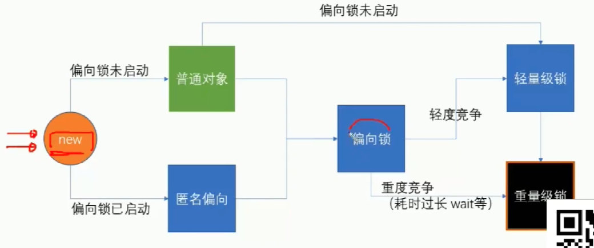
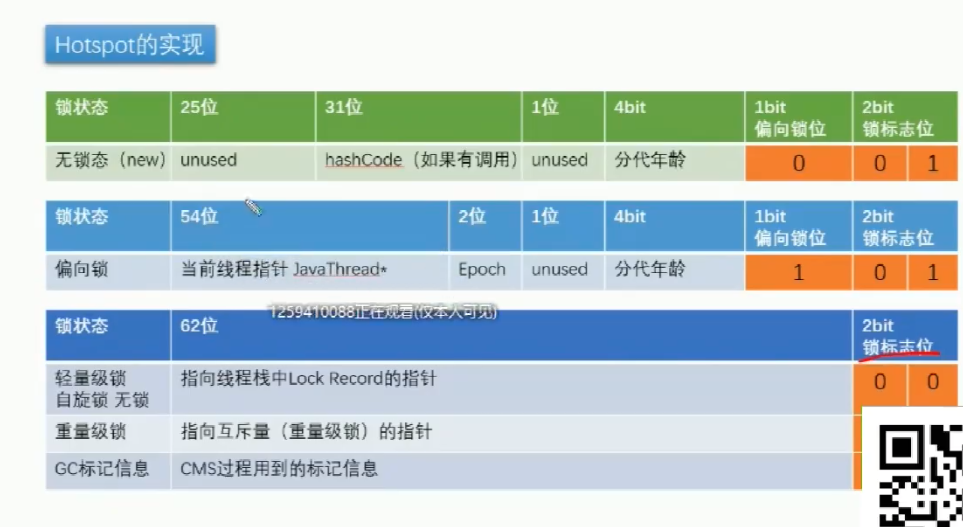
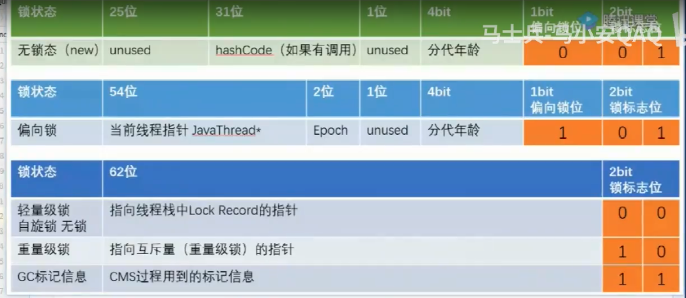

# Synchronized
互斥锁

对象布局
+ 对象头
    + mark word 8个字节
    + klass pointer 4个字节
    + 数组对象 数组长度
+ 成员变量
+ 对齐 补齐能被8字节整除

查看对象布局
```javaj
        <dependency>
            <groupId>org.openjdk.jol</groupId>
            <artifactId>jol-core</artifactId>
            <version>0.9</version>
        </dependency>
```
+ 重量级锁：
    + 老版本的jdk，JVM的线程与os线程是1:1的关系，锁的竞争交给的是操作系统调度，中间要经过操作系统，是重量级锁，没拿到锁的进入等待队列


+ 轻量级锁：
    + 没有经过操作系统，JVM中while循环判断
    + CAS
    + 可以保证原子性

## 重量级和轻量级的区别
是否需要经过操作系统调度

## CAS本身怎么保障原子性
    + 底层指令cmpxchg
    + cmpxchg会对总线加锁，防止其他cpu对其进行修改
    + 微观上的原子性

## Synchronized优化 锁升级


## 自旋锁效率是否一定比重量级锁高？
不是，不同场景
+ 自旋锁while循环，消耗CPU资源，不适合与执行时间很长，等待线程很多的情况
+ 重量级锁在等待队列中，不消耗CPU资源




## 偏向锁是否一定比自旋锁效率高
不一定，在明确直到会有多线程竞争的情况下，偏向锁肯定会涉及锁撤销，这时候直接使用自旋锁，涉及到了锁撤销所以会有额外的消耗


## 偏向锁
偏向锁本身就是一个标记，标记第一个拿到锁的线程，偏向于第一个线程
70%-80%的时间都是单线程

+ 偏向锁什么时候升级
发生竞争的时候进行偏向锁撤销，升级为轻量级的自旋锁

JVM默认启动4秒后启动偏向锁，因为启动之后的一段时间肯定会有多线程进行对象的空间分配，所以这时候没必要启用偏向锁


---------
[https://www.cnblogs.com/aspirant/p/11470858.html](https://www.cnblogs.com/aspirant/p/11470858.html)

Synchronized是Java中解决并发问题的一种最常用的方法，也是最简单的一种方法。

    Synchronized的作用主要有三个：
    原子性：确保线程互斥的访问同步代码；
    可见性：保证共享变量的修改能够及时可见，其实是通过Java内存模型中的 “对一个变量unlock操作之前，必须要同步到主内存中；如果对一个变量进行lock操作，则将会清空工作内存中此变量的值，在执行引擎使用此变量前，需要重新从主内存中load操作或assign操作初始化变量值” 来保证的；
    有序性：有效解决重排序问题，即 “一个unlock操作先行发生(happen-before)于后面对同一个锁的lock操作”；


## 对象布局
+ 对象头
    + mark word 8个字节
        + 哈希码
        + GC分代年龄
        + 锁状态标志
        + 线程持有的锁
        + 偏向线程ID
        + 偏向时间戳
    + klass pointer 4个字节
    + 数组对象 数组长度
+ 成员变量
+ 对齐 补齐能被8字节整除


锁主要存在四种状态，依次是：无锁状态、偏向锁状态、轻量级锁状态、重量级锁状态，锁可以从偏向锁升级到轻量级锁，再升级的重量级锁。但是锁的升级是单向的，也就是说只能从低到高升级，不会出现锁的降级。

在 JDK 1.6 中默认是开启偏向锁和轻量级锁的，可以通过-XX:-UseBiasedLocking来禁用偏向锁。

## 自旋锁
线程的阻塞和唤醒需要CPU从用户态转为核心态，频繁的阻塞和唤醒对CPU来说是一件负担很重的工作，势必会给系统的并发性能带来很大的压力。同时我们发现在许多应用上面，对象锁的锁状态只会持续很短一段时间，为了这一段很短的时间频繁地阻塞和唤醒线程是非常不值得的。

所以引入自旋锁，何谓自旋锁？ 

所谓自旋锁，就是指当一个线程尝试获取某个锁时，如果该锁已被其他线程占用，就一直循环检测锁是否被释放，而不是进入线程挂起或睡眠状态。

自旋锁适用于锁保护的临界区很小的情况，临界区很小的话，锁占用的时间就很短。自旋等待不能替代阻塞，虽然它可以避免线程切换带来的开销，但是它占用了CPU处理器的时间。如果持有锁的线程很快就释放了锁，那么自旋的效率就非常好，反之，自旋的线程就会白白消耗掉处理的资源，它不会做任何有意义的工作，典型的占着茅坑不拉屎，这样反而会带来性能上的浪费。所以说，自旋等待的时间（自旋的次数）必须要有一个限度，如果自旋超过了定义的时间仍然没有获取到锁，则应该被挂起。

自旋锁在JDK 1.4.2中引入，默认关闭，但是可以使用-XX:+UseSpinning开开启，在JDK1.6中默认开启。同时自旋的默认次数为10次，可以通过参数-XX:PreBlockSpin来调整。

如果通过参数-XX:PreBlockSpin来调整自旋锁的自旋次数，会带来诸多不便。假如将参数调整为10，但是系统很多线程都是等你刚刚退出的时候就释放了锁（假如多自旋一两次就可以获取锁），是不是很尴尬。于是JDK1.6引入自适应的自旋锁，让虚拟机会变得越来越聪明。

## 适应性自旋锁
JDK 1.6引入了更加聪明的自旋锁，即自适应自旋锁。所谓自适应就意味着自旋的次数不再是固定的，它是由前一次在同一个锁上的自旋时间及锁的拥有者的状态来决定。那它如何进行适应性自旋呢？ 

线程如果自旋成功了，那么下次自旋的次数会更加多，因为虚拟机认为既然上次成功了，那么此次自旋也很有可能会再次成功，那么它就会允许自旋等待持续的次数更多。反之，如果对于某个锁，很少有自旋能够成功，那么在以后要或者这个锁的时候自旋的次数会减少甚至省略掉自旋过程，以免浪费处理器资源。

有了自适应自旋锁，随着程序运行和性能监控信息的不断完善，虚拟机对程序锁的状况预测会越来越准确，虚拟机会变得越来越聪明。

## 锁消除

为了保证数据的完整性，在进行操作时需要对这部分操作进行同步控制，但是在有些情况下，JVM检测到不可能存在共享数据竞争，这是JVM会对这些同步锁进行锁消除。

***锁消除的依据是逃逸分析的数据支持***

如果不存在竞争，为什么还需要加锁呢？所以锁消除可以节省毫无意义的请求锁的时间。变量是否逃逸，对于虚拟机来说需要使用数据流分析来确定，但是对于程序员来说这还不清楚么？在明明知道不存在数据竞争的代码块前加上同步吗？但是有时候程序并不是我们所想的那样？虽然没有显示使用锁，但是在使用一些JDK的内置API时，如StringBuffer、Vector、HashTable等，这个时候会存在隐形的加锁操作。比如StringBuffer的append()方法，Vector的add()方法：

## 锁粗化
在使用同步锁的时候，需要让同步块的作用范围尽可能小—仅在共享数据的实际作用域中才进行同步，这样做的目的是 为了使需要同步的操作数量尽可能缩小，如果存在锁竞争，那么等待锁的线程也能尽快拿到锁。

在大多数的情况下，上述观点是正确的。但是如果一系列的连续加锁解锁操作，可能会导致不必要的性能损耗，所以引入锁粗话的概念。

锁粗话概念比较好理解，就是将多个连续的加锁、解锁操作连接在一起，扩展成一个范围更大的锁

如上面实例：

vector每次add的时候都需要加锁操作，JVM检测到对同一个对象（vector）连续加锁、解锁操作，会合并一个更大范围的加锁、解锁操作，即加锁解锁操作会移到for循环之外。

想有一个循环，循环里面是一些敏感操作，有的人就在循环里面写上了synchronized关键字。这样确实没错不过效率也许会很低，因为其频繁地拿锁释放锁。要知道锁的取得（假如只考虑重量级MutexLock）是需要操作系统调用的，从用户态进入内核态，开销很大(阿里面试)。于是针对这种情况也许虚拟机发现了之后会适当扩大加锁的范围（所以叫锁粗化）以避免频繁的拿锁释放锁的过程。

## 偏向锁
向锁是JDK6中的重要引进，因为HotSpot作者经过研究实践发现，在大多数情况下，锁不仅不存在多线程竞争，而且总是由同一线程多次获得，为了让线程获得锁的代价更低，引进了偏向锁。

偏向锁是在单线程执行代码块时使用的机制，如果在多线程并发的环境下（即线程A尚未执行完同步代码块，线程B发起了申请锁的申请），则一定会转化为轻量级锁或者重量级锁。

在JDK5中偏向锁默认是关闭的，而到了JDK6中偏向锁已经默认开启。如果并发数较大同时同步代码块执行时间较长，则被多个线程同时访问的概率就很大，就可以使用参数-XX:-UseBiasedLocking来禁止偏向锁(但这是个JVM参数，不能针对某个对象锁来单独设置)。

引入偏向锁主要目的是：为了在没有多线程竞争的情况下尽量减少不必要的轻量级锁执行路径。因为轻量级锁的加锁解锁操作是需要依赖多次CAS原子指令的，而偏向锁只需要在置换ThreadID的时候依赖一次CAS原子指令（由于一旦出现多线程竞争的情况就必须撤销偏向锁，所以偏向锁的撤销操作的性能损耗也必须小于节省下来的CAS原子指令的性能消耗）。

轻量级锁是为了在线程交替执行同步块时提高性能，而偏向锁则是在只有一个线程执行同步块时进一步提高性能。

当一个线程访问同步块并获取锁时，会在对象头和栈帧中的锁记录里存储锁偏向的线程ID，以后该线程进入和退出同步块时不需要花费CAS操作来争夺锁资源，只需要检查是否为偏向锁、锁标识为以及ThreadID即可，处理流程如下：

检测Mark Word是否为可偏向状态，即是否为偏向锁1，锁标识位为01；
若为可偏向状态，则测试线程ID是否为当前线程ID，如果是，则执行步骤（5），否则执行步骤（3）；
如果测试线程ID不为当前线程ID，则通过CAS操作竞争锁，竞争成功，则将Mark Word的线程ID替换为当前线程ID，否则执行线程（4）；
通过CAS竞争锁失败，证明当前存在多线程竞争情况，当到达全局安全点，获得偏向锁的线程被挂起，偏向锁升级为轻量级锁，然后被阻塞在安全点的线程继续往下执行同步代码块；
执行同步代码块；

## 轻量级锁
+ lock record

-------


+ 自旋锁虽然减少了因为阻塞带来的线程上下文切换开销，但是相应的会增加CPU处理时间，浪费CPU资源，因此之后有了自适应的自旋锁

+ 锁消除的例子比如jdk1.5之前，String的拼接使用的是StringBuffer，经过逃逸分析，方法内的对象不会逃逸处方法，那么就会消除StringBuffer中的synchronized锁

## monitor 源码解析


https://juejin.cn/post/6844903949334478855