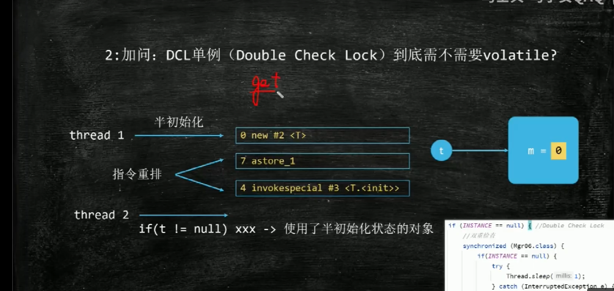
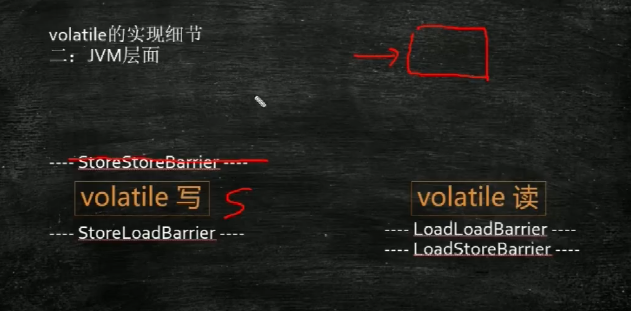

# 基本概念

## 什么是进程？什么是线程？
+ 进程是资源分配的基本单位
+ 线程是资源调度的基本单位

## 线程切换（线程调度）
保护线程-》恢复线程-》保护线程
线程切换需要消耗CPU资源，并不是线程数越多越好

## 线程可见性
+ cpu速度比内存速度快很多，为了提升效率，CPU和内存(主存)中间有许多缓存
+ 三层缓存，l1,l2,l3
+ 只有某些指令会触发读取主存
+ 局部性原理
    + 读取主存内容的时候，会一次读取一行（缓存行 64  bytes）
    + cache line 缓存行对齐 伪共享 （缓存一致性）
    + 位于同一缓存行的数据，一个线程修改了其中的一个数据，根据缓存一致性原理会通知其他使用了这行的线程
    + 缓存一致性协议都是属于“snooping(窥探)”协议，各个核能够时刻监控自己和其他核的状态，从而统一管理协调。窥探的思想是：CPU的各个缓存是独立的，但是内存却是共享的，所有缓存的数据最终都通过总线写入同一个内存，因此CPU各个核都能“看见”总线，即各个缓存不仅在进行内存数据交换的时候访问总线，还可以时刻“窥探”总线，监控其他缓存在干什么。因此当一个缓存在往内存中写数据时，其他缓存也都能“窥探”到，从而按照一致性协议保证缓存间的同步。
```java

    static class T {
        private long a;
    }

    private static T[] ts = new T[2];

    static {
        ts[0] = new T();
        ts[1] = new T();
    }

    private static CountDownLatch countDownLatch = new CountDownLatch(2);

    public static void main(String[] args) throws InterruptedException {
        long l = System.currentTimeMillis();
        new Thread(() -> {
            for (int i = 0; i < 10_0000_0000L; i++) {
                ts[0].a++;
            }
            countDownLatch.countDown();
        }).start();

        new Thread(() -> {
            for (int i = 0; i < 10_0000_0000L; i++) {
                ts[1].a++;
            }
            countDownLatch.countDown();
        }).start();


        countDownLatch.await();
        System.out.println(System.currentTimeMillis() - l);

    }
```

## @sun.misc.Contended
@sun.misc.Contended 是 Java 8 新增的一个注解，对某字段加上该注解则表示该字段会单独占用一个缓存行（Cache Line）。这里的缓存行是指 CPU 缓存（L1、L2、L3）的存储单元，常见的缓存行大小为 64 字节。

+ 避免伪共享
    + 为了提高读取速度，每个 CPU 有自己的缓存，CPU 读取数据后会存到自己的缓存里。而且为了节省空间，一个缓存行可能存储着多个变量，即伪共享。但是这对于共享变量，会造成性能问题：当一个 CPU 要修改某共享变量 A 时会先锁定自己缓存里 A 所在的缓存行，并且把其他 CPU 缓存上相关的缓存行设置为无效。但如果被锁定或失效的缓存行里，还存储了其他不相干的变量 B，其他线程此时就访问不了 B，或者由于缓存行失效需要重新从内存中读取加载到缓存里，这就造成了开销。所以让共享变量 A 单独使用一个缓存行就不会影响到其他线程的访问。


## volatile
保证可见性，volatile 修改了，会通知其他线程重新读


## 有序性
指令重排序是存在的，为了提升CPU执行效率

## DCL单例要不要加volatile



## happens-before原则（JVM规定重排序必须遵守的规则）


## volatile 怎么实现防止指令重排
+ JVM屏障
    + LoadLoad 屏障上的读和屏障下的读指令不能换顺序
    + StoreStore 屏障上的写和屏障下的写指令不能换顺序
    + LoadStore
    + StoreLoad
+ 屏障上下的指令不能换顺序




## 原子性
race condition =》 竞争条件，指的是多个线程反问共享数据发生竞争
数据的不一致性
如何保证数据一致 = 》 保障操作的原子性
持有锁的时候才能进行操作
临界区
synchronized 锁的是某个对象