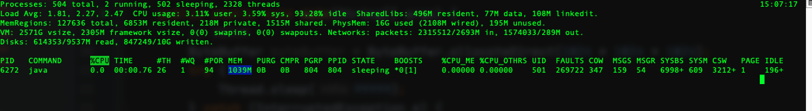

# Java 堆外内存回收原理

## 什么是堆外内存
+ 堆外内存（直接内存）不是JVM运行时数据区的一部分，也不是虚拟机规范中定义的内存区域
+ 直接内存是在Java堆外，直接向系统申请的内存空间

## 堆外内存的使用
可以通过ByteBuffer的静态方法allocateDirect(int capacity)分配堆外内存空间，下面举例说明分配的空间是在堆外的直接内存中。
```java
public class DirectByteBufferTest {


    public static void main(String[] args) {
        // 1024M
        ByteBuffer byteBuffer = ByteBuffer.allocateDirect(1024 * 1024 * 1024);
        try {
            Thread.sleep(99999);
        } catch (InterruptedException e) {
            e.printStackTrace();
        }
    }

}
```
上面的代码分配了1G的空间，使用jvisualvm查看堆内存空间可以看到并没有1GB内存被使用


但是通过top -pid 查看程序却发现占用了1g的内存空间，说明分配的是堆外内存



通过查看allocateDirect源码可知，内部调用了Unsafe类进行了内存的分配
```java
    DirectByteBuffer(int cap) {                   // package-private
        super(-1, 0, cap, cap);
        boolean pa = VM.isDirectMemoryPageAligned();
        int ps = Bits.pageSize();
        long size = Math.max(1L, (long)cap + (pa ? ps : 0));
        Bits.reserveMemory(size, cap);

        long base = 0;
        try {
            base = unsafe.allocateMemory(size);
        } catch (OutOfMemoryError x) {
            Bits.unreserveMemory(size, cap);
            throw x;
        }
        unsafe.setMemory(base, size, (byte) 0);
        if (pa && (base % ps != 0)) {
            // Round up to page boundary
            address = base + ps - (base & (ps - 1));
        } else {
            address = base;
        }
        cleaner = Cleaner.create(this, new Deallocator(base, size, cap));
        att = null;
    }
```
## JVM如何回收堆外内存
众所周知，垃圾回收是JVM规范的重要特征，它可以帮助将JVM中的垃圾对象进行回收释放，但是申请的堆外内存空间JVM又是如何释放的呢？下面的程序首先验证是否会对堆外分配的内存空间进行释放
```java
public class DirectByteBufferTest {


    public static void main(String[] args) {
        // 1024M
        ByteBuffer byteBuffer = ByteBuffer.allocateDirect(1024 * 1024 * 1024);
        try {
            Thread.sleep(20000);
        } catch (InterruptedException e) {
            e.printStackTrace();
        }
        byteBuffer = null;
        System.gc();
        try {
            Thread.sleep(100000);
        } catch (InterruptedException e) {
            e.printStackTrace();
        }

    }

}
```
上述程序在分配完堆外空间后，将局部变量表中的byteBuffer引用类型变量置为null，后调用System.gc()显示触发Full GC，通过查看内存可以发现堆外空间的确被释放掉了。由此可见，当byteBuffer作为GC Roots的强引用链断开后，分配的堆外空间在GC后也得到了释放。

通过源码得知，DirectByteBuffer有个内部对象Cleaner，再分配堆外空间的同时，通过调用Cleaner的静态方法，创建一个Cleaner对象
```java
cleaner = Cleaner.create(this, new Deallocator(base, size, cap));
```

Cleaner 对象内部的Deallocator是一个继承了Runnable接口的类，其代码如下
```java
private static class Deallocator
        implements Runnable
    {

        private static Unsafe unsafe = Unsafe.getUnsafe();

        private long address;
        private long size;
        private int capacity;

        private Deallocator(long address, long size, int capacity) {
            assert (address != 0);
            this.address = address;
            this.size = size;
            this.capacity = capacity;
        }

        public void run() {
            if (address == 0) {
                // Paranoia
                return;
            }
            unsafe.freeMemory(address);
            address = 0;
            Bits.unreserveMemory(size, capacity);
        }

    }
```

可以看到在方法run中调用了Unsafe的方法对分配的堆外内存空间进行了释放，那么这个方法又是何时被调用的呢？Cleaner继承了虚引用PhantomReference，对与虚引用，其特点如下：
+ 虚引用    
    + 无法通过虚引用获取一个实例对象
    + 使用虚引用的唯一目的就是能在这个对象被回收时收到一个系统通知
    + 在被回收之前放入引用队列中;
    + 试图通过虚引用的get方法获得对象，总是null;
    + 可以用来记录一些资源释放操作的执行时间和记录;
    + 必须使用引用队列;

而DirectByteBuffer创建的cleaner对象正是对directByteBuffer对象本身的一个虚引用，也就是说当directByteBuffer强引用失效时，会将Cleaner对象放入注册的引用队列当中，相当于注册一个事件，在此之前，Referenc会调用Cleaner的clean方法
```java
    static boolean tryHandlePending(boolean waitForNotify) {
        Reference<Object> r;
        Cleaner c;
        try {
            synchronized (lock) {
                if (pending != null) {
                    r = pending;
                    // 'instanceof' might throw OutOfMemoryError sometimes
                    // so do this before un-linking 'r' from the 'pending' chain...
                    c = r instanceof Cleaner ? (Cleaner) r : null;
                    // unlink 'r' from 'pending' chain
                    pending = r.discovered;
                    r.discovered = null;
                } else {
                    // The waiting on the lock may cause an OutOfMemoryError
                    // because it may try to allocate exception objects.
                    if (waitForNotify) {
                        lock.wait();
                    }
                    // retry if waited
                    return waitForNotify;
                }
            }
        } catch (OutOfMemoryError x) {
            // Give other threads CPU time so they hopefully drop some live references
            // and GC reclaims some space.
            // Also prevent CPU intensive spinning in case 'r instanceof Cleaner' above
            // persistently throws OOME for some time...
            Thread.yield();
            // retry
            return true;
        } catch (InterruptedException x) {
            // retry
            return true;
        }

        // Fast path for cleaners
        if (c != null) {
            c.clean();
            return true;
        }

        ReferenceQueue<? super Object> q = r.queue;
        if (q != ReferenceQueue.NULL) q.enqueue(r);
        return true;
    }
```

再查看cleaner的clean方法
```java
public void clean() {
        if (remove(this)) {
            try {
                this.thunk.run();
            } catch (final Throwable var2) {
                AccessController.doPrivileged(new PrivilegedAction<Void>() {
                    public Void run() {
                        if (System.err != null) {
                            (new Error("Cleaner terminated abnormally", var2)).printStackTrace();
                        }

                        System.exit(1);
                        return null;
                    }
                });
            }

        }
    }
```
其中的this.thunk就是上面说的Deallocator，调用run方法，使用Unsafe类释放堆外空间。