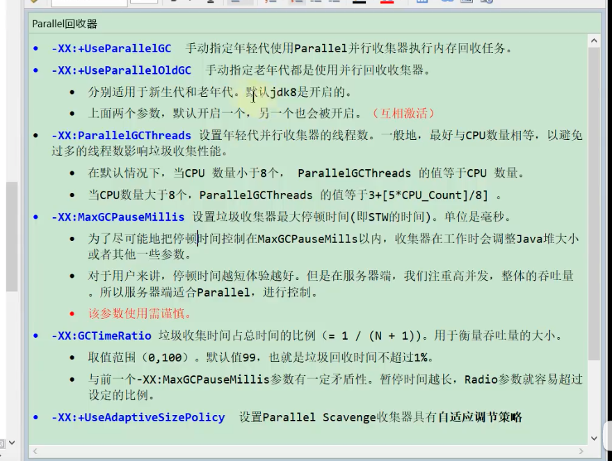

# 垃圾回收器的选择

[https://zhuanlan.zhihu.com/p/264330138](https://zhuanlan.zhihu.com/p/264330138)

明确垃圾回收器组合
    -XX:+UseSerialGC 年轻代和老年代都用串行收集器

    -XX:+UseParNewGC 年轻代使用ParNew，老年代使用 Serial Old

    -XX:+UseParallelGC 年轻代使用Paraller Scavenge，老年代使用Serial Old

    -XX:+UseParallelOldGC 新生代Paraller Scavenge，老年代使用Paraller Old

    -XX:+UseConcMarkSweepGC，表示年轻代使用ParNew，老年代的用CMS + Serial Old

    -XX:+UseG1GC 使用G1垃圾回收器

    -XX:+UseZGC 使用ZGC垃圾回收器

垃圾收集器跟内存大小的大致关系（不精确，需要根据实际环境测试）
Serial：几十兆
PS：上百兆 ~ 4G
CMS：4G ~ 10G
G1：10G~上百G
ZGC： 4T - 16T（JDK13）

## 常见的垃圾回收器
JDK诞生 Serial追随 提高效率，诞生了PS，为了配合CMS，诞生了PN，CMS是1.4版本后期引入，CMS是里程碑式的GC，它开启了并发回收的过程，但是CMS毛病较多，因此目前任何一个JDK版本默认是CMS 并发垃圾回收是因为无法忍受STW
Serial 年轻代 串行回收
PS 年轻代 并行回收
ParNew 年轻代 配合CMS的并行回收
SerialOld
ParallelOld
ConcurrentMarkSweep 老年代 并发的， 垃圾回收和应用程序同时运行，降低STW的时间(200ms) CMS问题比较多，所以现在没有一个版本默认是CMS，只能手工指定 CMS既然是MarkSweep，就一定会有碎片化的问题，碎片到达一定程度，CMS的老年代分配对象分配不下的时候，使用SerialOld 进行老年代回收 想象一下：PS + PO -> 加内存 换垃圾回收器 -> PN + CMS + SerialOld（几个小时 - 几天的STW） 几十个G的内存，单线程回收 -> G1 + FGC 几十个G -> 上T内存的服务器 ZGC 算法：三色标记 + Incremental Update
G1(10ms) 算法：三色标记 + SATB
ZGC (1ms) PK C++ 算法：ColoredPointers + LoadBarrier
Shenandoah 算法：ColoredPointers + WriteBarrier
Eplison
常见垃圾回收器组合参数设定：(1.8)

-XX:+UseSerialGC = Serial New (DefNew) + Serial Old

小型程序。默认情况下不会是这种选项，HotSpot会根据计算及配置和JDK版本自动选择收集器

-XX:+UseParNewGC = ParNew + SerialOld这个组合已经很少用（在某些版本中已经废弃）
-XX:+UseConc(urrent)MarkSweepGC = ParNew + CMS + Serial Old
-XX:+UseParallelGC = Parallel Scavenge + Parallel Old (1.8默认) 【PS + SerialOld】
-XX:+UseParallelOldGC = Parallel Scavenge + Parallel Old
-XX:+UseG1GC = G1

默认GC的查看方法

1.java -XX:+PrintCommandLineFlags -version

2.通过GC的日志来分辨

Linux下1.8版本默认的垃圾回收器到底是什么？
1.8.0_181 默认（看不出来）Copy MarkCompact
1.8.0_222 默认 PS + PO
面对如此众多的垃圾回收器，我们应该如何选择一款适合自己应用的收集器呢？这个问题的答案主要受以下三个因素影响：

应用程序的主要关注点是什么？
数据分析、科学计算类的任务，目标是能尽快算出结果，那吞吐量就是主要关注点；
SLA 应用，那停顿时间直接影响服务质量，严重的甚至会导致事务超时，这样延迟就是主要关注点；
客户端应用或者嵌入式应用，那垃圾收集的内存占用则是不可忽视的。
运行应用的基础设施如何？
譬如硬件规格，要涉及的系统架构是 x86-32/64、SPARC 还是ARM/Aarch64；处理器的数量多少，分配内存的大小；选择的操作系统是 Linux、Solaris 还是 Windows等。

使用 JDK 的发行商是什么？
版本号是多少？是 ZingJDK/Zulu、OracleJDK、Open-JDK、OpenJ9 抑或是其他公司的发行版？该 JDK 对应了《Java 虚拟机规范》的哪个版本？

举栗说明
一般来说，收集器的选择就从以上这几点出发来考虑。

举个例子，假设某个直接面向用户提供服务的 B/S 系统准备选择垃圾收集器，一般来说延迟时间是这类应用的主要关注点，那么：

如果你有充足的预算但没有太多调优经验，那么一套带商业技术支持的专有硬件或者软件解决方案是不错的选择，Azul 公司以前主推的 Vega 系统和现在主推的 Zing VM 是这方面的代表，这样你就可以使用传说中的 C4 收集器了。
如果你虽然没有足够预算去使用商业解决方案，但能够掌控软硬件型号，使用较新的版本，同时又特别注重延迟，那 ZGC 很值得尝试。
如果你对还处于实验状态的收集器的稳定性有所顾虑，或者应用必须运行在 Win-dows 操作系统下，那 ZGC 就无缘了，试试 Shenandoah 吧
如果你接手的是遗留系统，软硬件基础设施和 JDK 版本都比较落后，那就根据内存规模衡量一下，对于大概 10G 以下的堆内存，CMS 一般能处理得比较好，而对于更大的堆内存，可重点考察一下 G1。（这个一般现阶段使用较多）
当然，以上都是仅从理论出发的分析，实战中切不可纸上谈兵，根据系统实际情况去测试才是选择收集器的最终依据。

# parallelGC

