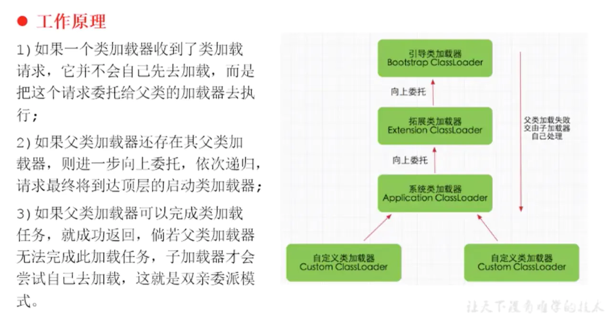

# 类加载子系统

## JVM架构图

**JVM主要由三大部分组成**
+ 类加载子系统(Class Loader SubSystem)
+ 运行时数据区
+ 执行引擎

___
## 类加载子系统的作用
+ 类加载子系统负责从文件系统，网络或数据库中加载编译好的字节码.Class文件，字节码文件开头有着特定的标示，即魔数(magic number)CAFE BABE;
+ 类加载子系统只负责class文件的加载，是否可以运行则又执行引擎决定;
+ 加载后的类信息存放在方法区中，jdk7称之为永久代，jdk8之后称之为元空间。除了类信息之外，方法区还存在运行时常量池信息，包括字符串字面量和数字常量，同时在后面运行时数据区关于栈帧中动态链接所用到的虚函数表也存在与方法区中，jdk8之后方法区与内存相关联；

类加载子系统加载类文件的步骤分为：加载->链接->初始化

### 加载
+ 通过一个类的全限定名获取类文件的二进制字节流；
+ 将这个字节流所代表的的静态存储结构转化为方法区的运行时数据；
+ 在内存中生成一个代表这个类的java.lang.Class对象，作为方法区这个类的各种数据的访问入口

### 链接
链接过程主要包含三个步骤：验证->准备->解析

#### 验证 Verify
+ 目的在于确保Class文件的字节流中包含信息符合当前虚拟机要求，保证被加载类的正确性，不会危害虚拟机自身安全。
+ 主要包括四种验证，文件格式验证，源数据验证，字节码验证，符号引用验证。

#### 准备 Prepare
+ 为类变量分配内存并且为该变量赋0值；
+ 这里不包含用final修饰的static 常量，因为final在编译的时候就会分配了，准备阶段会显式初始化；
+ 不会为实例变量分配初始化，类变量会分配在方法区中，而实例变量是会随着对象一起分配到java堆中。

#### 解析 Resolve
+ 将常量池内的符号引用转换为直接引用的过程。
事实上，解析操作会伴随着jvm在执行完初始化之后再执行
+ 符号引用就是一组符号来描述所引用的目标。符号应用的字面量形式明确定义在《java虚拟机规范》的class文件格式中。直接引用就是直接指向目标的指针、相对偏移量或一个间接定位到目标的句柄
+ 解析动作主要针对类或接口、字段、类方法、接口方法、方法类型等。对应常量池中的CONSTANT_Class_info/CONSTANT_Fieldref_info、CONSTANT_Methodref_info等。

### 初始化
+ 初始化阶段就是执行类构造器方法clinit（）的过程。
此方法不需要定义，是javac编译器自动收集类中的所有类变量的赋值动作和静态代码块中的语句合并而来。 ***如果没有静态变量和静态代码块，那么字节码文件中就不会有clinit方法***
+ 构造器方法中指令按语句在源文件中出现的顺序执行
+ 若该类具有父类，jvm会保证子类的clinit()执行前，父
类的clinit()已经执行完毕
+ 虚拟机必须保证一个类的clinit()方法在多线程下被同步加锁
----

## 类加载器的分类

+ 引导类加载器<br>
    即BootStrap ClassLoader，底层使用c c++ 代码编写
+ 自定义加载器<br>
    jvm将所有***派生于抽象类ClassLoader的类加载器都划分为自定义类加载器***，例如扩展类加载器，系统类加载器
+
### 几种加载器
+ 启动类加载器（引导类加载器，BootStrap ClassLoader）
    + 这个类加载使用C/C++语言实现的，嵌套在JVM内部
它用来加载java的核心库（JAVA_HOME/jre/lib/rt.jar/resources.jar或sun.boot.class.path路径下的内容），用于提供JVM自身需要的类；
    + 并不继承自java.lang.ClassLoader,没有父加载器；
    + 加载拓展类和应用程序类加载器，并指定为他们的父加载器；
    + 处于安全考虑，BootStrap启动类加载器只加载包名为java、javax、sun等开头的类；

+ 拓展类加载器（Extension ClassLoader）
    + java语言编写 ，由sun.misc.Launcher$ExtClassLoader实现；
    + 派生于ClassLoader类；
    + 父类加载器为启动类加载器；
    + 从java.ext.dirs系统属性所指定的目录中加载类库，或从JDK的安装目录的jre/lib/ext子目录（扩展目录）下加载类库。如果用户创建的JAR放在此目录下，也会由拓展类加载器自动加载

+ 应用程序类加载器（系统类加载器，AppClassLoader）
    + java语言编写， 由sun.misc.Launcher$AppClassLoader实现；
    + 派生于ClassLoader类；
    + 父类加载器为拓展类加载器；
    + 它负责加载环境变量classpath或系统属性 java.class.path指定路径下的类库；
    + 该类加载器是程序中默认的类加载器，一般来说，java应用的类都是由它来完成加载；
    + 通过ClassLoader#getSystemClassLoader()方法可以获取到该类加载器；

```java
/**
 * 虚拟机自带加载器
 */
public class ClassLoaderTest1 {
    public static void main(String[] args) {
        System.out.println("********启动类加载器*********");
        URL[] urls = sun.misc.Launcher.getBootstrapClassPath().getURLs();
        //获取BootStrapClassLoader能够加载的api路径
        for (URL e:urls){
            System.out.println(e.toExternalForm());
        }

        //从上面的路径中随意选择一个类 看看他的类加载器是什么
        //Provider位于 /jdk1.8.0_171.jdk/Contents/Home/jre/lib/jsse.jar 下，引导类加载器加载它
        ClassLoader classLoader = Provider.class.getClassLoader();
        System.out.println(classLoader);//null

        System.out.println("********拓展类加载器********");
        String extDirs = System.getProperty("java.ext.dirs");
        for (String path : extDirs.split(";")){
            System.out.println(path);
        }
        //从上面的路径中随意选择一个类 看看他的类加载器是什么:拓展类加载器
        ClassLoader classLoader1 = CurveDB.class.getClassLoader();
        System.out.println(classLoader1);//sun.misc.Launcher$ExtClassLoader@4dc63996
    }
}

```    

### 用户自定义加载器的好处
+ 隔离加载类，例如阿里的SoFaBoot类隔离；
+ 修改类加载的方式，扩展加载源，可以从数据库或自定义读取；
+ 防止源码泄漏，对编译后的源码进行加密，再通过自定义解密的自定义加载器进行加载，起到一个加壳的效果；

## ***双亲委派机制***
Java虚拟机对class文件采用的是按需加载的方式，也就是说当需要使用该类时才会将她的class文件加载到内存生成的class对象。而且加载某个类的class文件时，java虚拟机采用的是双亲委派模式，即把请求交由父类处理，它是一种任务委派模式
### 工作原理


### 源码
```java
/**
     * Loads the class with the specified <a href="#name">binary name</a>.  The
     * default implementation of this method searches for classes in the
     * following order:
     *
     * <ol>
     *
     *   <li><p> Invoke {@link #findLoadedClass(String)} to check if the class
     *   has already been loaded.  </p></li>
     *
     *   <li><p> Invoke the {@link #loadClass(String) <tt>loadClass</tt>} method
     *   on the parent class loader.  If the parent is <tt>null</tt> the class
     *   loader built-in to the virtual machine is used, instead.  </p></li>
     *
     *   <li><p> Invoke the {@link #findClass(String)} method to find the
     *   class.  </p></li>
     *
     * </ol>
     *
     * <p> If the class was found using the above steps, and the
     * <tt>resolve</tt> flag is true, this method will then invoke the {@link
     * #resolveClass(Class)} method on the resulting <tt>Class</tt> object.
     *
     * <p> Subclasses of <tt>ClassLoader</tt> are encouraged to override {@link
     * #findClass(String)}, rather than this method.  </p>
     *
     * <p> Unless overridden, this method synchronizes on the result of
     * {@link #getClassLoadingLock <tt>getClassLoadingLock</tt>} method
     * during the entire class loading process.
     *
     * @param  name
     *         The <a href="#name">binary name</a> of the class
     *
     * @param  resolve
     *         If <tt>true</tt> then resolve the class
     *
     * @return  The resulting <tt>Class</tt> object
     *
     * @throws  ClassNotFoundException
     *          If the class could not be found
     */
    protected Class<?> loadClass(String name, boolean resolve)
        throws ClassNotFoundException
    {
        synchronized (getClassLoadingLock(name)) {
            // First, check if the class has already been loaded
            Class<?> c = findLoadedClass(name);
            if (c == null) {
                long t0 = System.nanoTime();
                try {
                    if (parent != null) {
                        c = parent.loadClass(name, false);
                    } else {
                        c = findBootstrapClassOrNull(name);
                    }
                } catch (ClassNotFoundException e) {
                    // ClassNotFoundException thrown if class not found
                    // from the non-null parent class loader
                }

                if (c == null) {
                    // If still not found, then invoke findClass in order
                    // to find the class.
                    long t1 = System.nanoTime();
                    c = findClass(name);

                    // this is the defining class loader; record the stats
                    sun.misc.PerfCounter.getParentDelegationTime().addTime(t1 - t0);
                    sun.misc.PerfCounter.getFindClassTime().addElapsedTimeFrom(t1);
                    sun.misc.PerfCounter.getFindClasses().increment();
                }
            }
            if (resolve) {
                resolveClass(c);
            }
            return c;
        }
    }
```

### 优点
+ 避免类的重复加载
+ 保护程序安全，防止核心API被随意篡改


## 拓展
+ [如何实现Java类隔离加载](https://blog.csdn.net/gisredevelopment/article/details/111962597)
+ 在jvm中表示两个class对象是否为同一个类存在的两个必要条件
    + 类的完整类名必须一致，包括包名
    + 加载这个类的ClassLoader（指ClassLoader实例对象）必须相同
+ [破坏双亲委派机制](https://zhuanlan.zhihu.com/p/185612299)
+ [Tomcat的类加载机制](https://www.cnblogs.com/fanguangdexiaoyuer/p/10213324.html)
    + jsp编译成class文件想要执行热插拔，必定要每个jsp文件一个类加载器，在修改后卸载原先的类加载器，创建新的类加载器即可