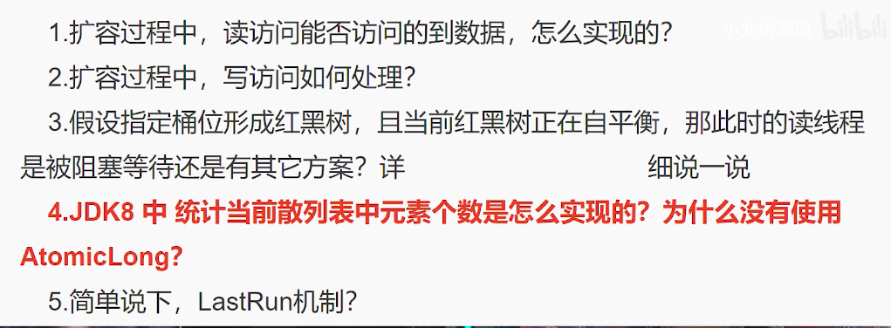

# ConcurrentHashMap

## 面试



## JDK7中的实现方式
+ Segment[]
    + HashEntry[]

ConcurrentHashMap 是一个 Segment 数组，Segment 通过继承 ReentrantLock 来进行加锁，所以每次需要加锁的操作锁住的是一个 Segment，这样只要保证每个 Segment 是线程安全的，也就实现了全局的线程安全。

```java
// segement数量 代码中初始化的时候会限制segement的数量为大于等于这个数的最大2的幂
private static final int DEFAULT_CONCURRENCY_LEVEL = 16;
```

+ 代码中的segement[0]在初始化的时候已经创建，之后的segement都是null，在第一次操作的时候会通过segement[0]进行初始化，属于设计模式中的原型设计模式，防止创建某些需要消耗资源计算的操作，直接实现Clonable接口，重写clone方法，实现原型模式，同时为了防止多个线程同时创建k位置的segement，使用Unsafe底层的cas自旋操作进行原型创建


+ Unsafe 静态方法getUnsafe会判断调用类的类加载器是否为null，即是否是引导类加载器，如果不是则抛出异常
```
    @CallerSensitive
    public static Unsafe getUnsafe() {
        Class var0 = Reflection.getCallerClass();
        if (!VM.isSystemDomainLoader(var0.getClassLoader())) {
            throw new SecurityException("Unsafe");
        } else {
            return theUnsafe;
        }
    }
```
+ 可以通过反射的方法拿到Unsafe的静态实例对象


### key 和 value不能为null
+ null会带来二义性
+ 线程A调用concurrentHashMap.get(key)方法,返回为null，我们还是不知道这个null是  没有映射的null还是存的值就是null。

    我们假设此时返回为null的真实情况就是因为这个key没有在map里面映射过。那么我们可以用concurrentHashMap.containsKey(key)来验证我们的假设是否成立，我们期望的结果是返回false。

    但是在我们调用concurrentHashMap.get(key)方法之后，containsKey方法之前，有一个线程B执行了concurrentHashMap.put(key,null)的操作。那么我们调用containsKey方法返回的就是true了。这就与我们的假设的真实情况不符合了。

---
+ jdk7 版本在put的时候通过锁获（可重入锁）取操纵权，多线程情况下，没有获取到锁的线程会利用tryLock的时间进行new Node的操作

+ jdk7 的get直接利用unsafe获取volatile

## LastRun （蜘蛛纸牌？？？）
在rehash的时候需要重新rehash，首先遍历一次，找到最后一个lastRun节点，该节点到最后的节点rehash后的值是一样的，所以直接将lastRun节点插入到新的节点位置，之后再遍历一次，对lastRun节点之前的节点利用头插法进行rehash

## size方法
1.7 中是先不加锁计算三次，判断每一次的modCount是否相同，如果相同表明没有修改，直接返回；如果三次结果都不一样在加锁，进行计算++，最后释放锁


---
## JDK8 中的实现方式
# 难点
+ ***扩容 transfer***
+ transfer
+ ***size***

---
+ 放弃了Segemnt分段锁的思想，底层还是Node数组
+ 使用Unsafe cas 自旋的方式创建新节点


## TreeNode 红黑树
***HashMap中的红黑树既是红黑树又是双向链表***
+ 在rehash看扩容过程中过程中，会通过双向指针将红黑树根据rehash之后的值split成两个数组链表，如果长度小于6 untreeify成链表，否则重新treeify成一个红黑树
```java
 final void split(HashMap<K,V> map, Node<K,V>[] tab, int index, int bit) {
            TreeNode<K,V> b = this;
            // Relink into lo and hi lists, preserving order
            TreeNode<K,V> loHead = null, loTail = null;
            TreeNode<K,V> hiHead = null, hiTail = null;
            int lc = 0, hc = 0;
            for (TreeNode<K,V> e = b, next; e != null; e = next) {
                next = (TreeNode<K,V>)e.next;
                e.next = null;
                if ((e.hash & bit) == 0) {
                    if ((e.prev = loTail) == null)
                        loHead = e;
                    else
                        loTail.next = e;
                    loTail = e;
                    ++lc;
                }
                else {
                    if ((e.prev = hiTail) == null)
                        hiHead = e;
                    else
                        hiTail.next = e;
                    hiTail = e;
                    ++hc;
                }
            }

            if (loHead != null) {
                if (lc <= UNTREEIFY_THRESHOLD)
                    tab[index] = loHead.untreeify(map);
                else {
                    tab[index] = loHead;
                    if (hiHead != null) // (else is already treeified)
                        loHead.treeify(tab);
                }
            }
            if (hiHead != null) {
                if (hc <= UNTREEIFY_THRESHOLD)
                    tab[index + bit] = hiHead.untreeify(map);
                else {
                    tab[index + bit] = hiHead;
                    if (loHead != null)
                        hiHead.treeify(tab);
                }
            }
        }
```

## size 
jdk8 中cHashMap设置大小，多线程下会通过cas设置baseCount的值++，那么同一时刻多个线程只会有一个线程操作成功，其他操作失败的线程则会通过线程产生的随机树进行hash到CounterCell数组的对象，对CounterCell这个对象的值进行++；调用size()方法的逻辑就是baseCount加上所有CounterCell对象里的value值
+ 这样的好处就是分散竞争
```java
final long sumCount() {
    CounterCell[] as = counterCells; CounterCell a;
    long sum = baseCount;
    if (as != null) {
        for (int i = 0; i < as.length; ++i) {
            if ((a = as[i]) != null)
                sum += a.value;
        }
    }
    return sum; 
}
```

分散竞争
```java
 private final void addCount(long x, int check) {
        CounterCell[] as; long b, s;
        if ((as = counterCells) != null ||
            !U.compareAndSwapLong(this, BASECOUNT, b = baseCount, s = b + x)) {
            CounterCell a; long v; int m;
            boolean uncontended = true;
            if (as == null || (m = as.length - 1) < 0 ||
                (a = as[ThreadLocalRandom.getProbe() & m]) == null ||
                !(uncontended =
                  U.compareAndSwapLong(a, CELLVALUE, v = a.value, v + x))) {
                fullAddCount(x, uncontended);
                return;
            }
            if (check <= 1)
                return;
            s = sumCount();
        }
```

+ 源码中许多代码是为了防止线程空闲


## 一些需要记住的问题

+ Hashtable和ConcurrentHashMap最重要的不同?
    + 底层实现不同，Hashtable 数组+ 链表，ConcurrentHashMap 数组+ 链表+ 红黑树
    + Hashtable方法级别的synchronized 而 ConcurrentHashMap锁住的其实内部Node数组中的对象，即Node[i]

+ JDK7 ConcurrentHashMap get方法是阻塞的吗？
    + JDK7 的个体方法是通过Unsafe中的getObjectVolatile方法进行volatile语义的读，获取到segments在偏移量为u位置的分段Segment，第一次初始化通过getObjectVolatile获取HashEntry时，获取到的是主存中最新的数据，但是在后续遍历过程中，有可能数据被其它线程修改从而导致其实这里最终返回的可能是过时的数据，所以这里就是ConcurrentHashMap所谓的弱一致性的体现

+ JDK8 ConcurrentHashMap 扩容过程中读访问能否访问到数据，是怎么实现的？(为什么get方法不需要加锁)
    + get操作全程不需要加锁是因为Node的成员val是用volatile修饰的和数组用volatile修饰没有关系
    + 如果遇到扩容的时候，会调用标志正在扩容节点ForwardingNode的find方法，查找该节点，匹配就返回
    + 都不符合的话，就往下遍历节点，匹配就返回，否则最后就返回null
```java
public V get(Object key) {
    Node<K,V>[] tab; Node<K,V> e, p; int n, eh; K ek;
    int h = spread(key.hashCode());
    if ((tab = table) != null && (n = tab.length) > 0 &&
        (e = tabAt(tab, (n - 1) & h)) != null) {
        if ((eh = e.hash) == h) {
            if ((ek = e.key) == key || (ek != null && key.equals(ek)))
                return e.val;
        }
        else if (eh < 0)
            return (p = e.find(h, key)) != null ? p.val : null;
        while ((e = e.next) != null) {
            if (e.hash == h &&
                ((ek = e.key) == key || (ek != null && key.equals(ek))))
                return e.val;
        }
    }
    return null;
}
```
如果当前节点是ForwardNode，表示正在扩容，会调用ForwardNode的find方法，这个方法内部会去newTable搜索，期间如果发现又在扩容会一直对扩容的新数组进行搜索
```java
    Node<K,V> find(int h, Object k) {
        // loop to avoid arbitrarily deep recursion on forwarding nodes
        outer: for (Node<K,V>[] tab = nextTable;;) {
            Node<K,V> e; int n;
            if (k == null || tab == null || (n = tab.length) == 0 ||
                (e = tabAt(tab, (n - 1) & h)) == null)
                return null;
            for (;;) {
                int eh; K ek;
                if ((eh = e.hash) == h &&
                    ((ek = e.key) == k || (ek != null && k.equals(ek))))
                    return e;
                if (eh < 0) {
                    if (e instanceof ForwardingNode) {
                        tab = ((ForwardingNode<K,V>)e).nextTable;
                        continue outer;
                    }
                    else
                        return e.find(h, k);
                }
                if ((e = e.next) == null)
                    return null;
            }
        }
    }
```

+ 扩容过程中，写访问如何处理
    + 首先，如果访问的是一个空Node，说明这个Node还没有初始化，这时候使用CAS新创建Node对象
    + 如果，这个Node的hash值是MOVED，表示当前数组正在扩容当中，此时这个线程会去调用helpTransfer方法帮助扩容（多线程扩容机制）
    + 如果不是上述两种情况，则使用synchrnized锁住这个Node[i],进行put操作

+ 假设指定桶位形成BinTree红黑树节点，当前红黑树正在自平衡，那此时读线程是被阻塞还是有其他方案？
    + 如果这个节点位置是BinTree类型，代表这个节点的数据是红黑树，如果这个时候红黑树正在自平衡代表加了写锁，此时读线程采用遍历双向链表的方式进行读操作，退化成链表线性查找
[https://ask.naixuejiaoyu.com/article/956](https://ask.naixuejiaoyu.com/article/956)

```java
/**
    * Returns matching node or null if none. Tries to search
    * using tree comparisons from root, but continues linear
    * search when lock not available.
    */
 final Node<K,V> find(int h, Object k) {
            if (k != null) {
                for (Node<K,V> e = first; e != null; ) {
                    int s; K ek;
                    if (((s = lockState) & (WAITER|WRITER)) != 0) {
                        if (e.hash == h &&
                            ((ek = e.key) == k || (ek != null && k.equals(ek))))
                            return e;
                        e = e.next;
                    }
                    else if (U.compareAndSwapInt(this, LOCKSTATE, s,
                                                 s + READER)) {
                        TreeNode<K,V> r, p;
                        try {
                            p = ((r = root) == null ? null :
                                 r.findTreeNode(h, k, null));
                        } finally {
                            Thread w;
                            if (U.getAndAddInt(this, LOCKSTATE, -READER) ==
                                (READER|WAITER) && (w = waiter) != null)
                                LockSupport.unpark(w);
                        }
                        return p;
                    }
                }
            }
            return null;
        }
```

+ jdk8统计散列表个数是怎么实现的？为什么没用AtomicLong
    + 使用CAS对baseCount++，CAS失败的线程使用hash 获取Conuter对象，再设置值
    + 查询的时候把每个Counter对象的值加起来，再加上baseCount的值就是size
    + 但是高并发下，这个值仍然可能是不准确的

+ LastRun 机制
    + 在扩容rehash的时候对原链表


## 完全由线程安全类组成的程序不一定是线程安全的
+ 虽然ConcurrentHashMap内部的操作是线程安全的，但是如果程序使用不当还是会出现不安全，例如下面：
```java
private static ConcurrentHashMap<Integer, Object> hashMap;

public static void putIfAbsent(int key, Function<Integer, Object> callback) {
    if (!hashMap.contains(key)) {
        hashMap.put(key, callback.apply(key));
    }
}
```
多个线程都判断不存在key的value，都会put一个新的value，出现问题
+ 解决办法是可以使用putIfAbsent,确保不重新new 一个新的对象