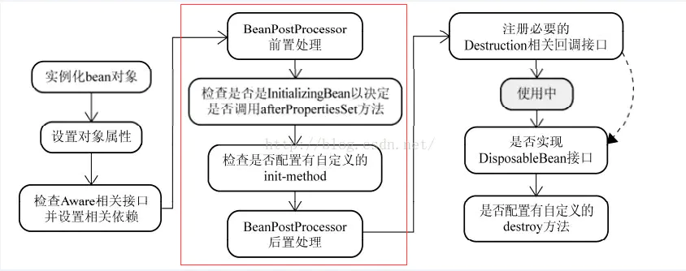

# IOC
控制反转

## IOC容器
存放对象的容器
Map

+ BeanDefinition  
+ BeanDefinitionReader bean定义读取器
+ BeanFactory
+ BeanFactoryPostProcessor
+ BeanPostProcessor

## Bean的生命周期
标准顺序

    * 
Bean factory implementations should support the standard bean lifecycle interfaces
    * as far as possible. The full set of initialization methods and their standard order is:
    * <ol>
    * <li>BeanNameAware's {@code setBeanName}
    * <li>BeanClassLoaderAware's {@code setBeanClassLoader}
    * <li>BeanFactoryAware's {@code setBeanFactory}
    * <li>EnvironmentAware's {@code setEnvironment}
    * <li>EmbeddedValueResolverAware's {@code setEmbeddedValueResolver}
    * <li>ResourceLoaderAware's {@code setResourceLoader}
    * (only applicable when running in an application context)
    * <li>ApplicationEventPublisherAware's {@code setApplicationEventPublisher}
    * (only applicable when running in an application context)
    * <li>MessageSourceAware's {@code setMessageSource}
    * (only applicable when running in an application context)
    * <li>ApplicationContextAware's {@code setApplicationContext}
    * (only applicable when running in an application context)
    * <li>ServletContextAware's {@code setServletContext}
    * (only applicable when running in a web application context)
    * <li>{@code postProcessBeforeInitialization} methods of BeanPostProcessors
    * <li>InitializingBean's {@code afterPropertiesSet}
    * <li>a custom init-method definition
    * <li>{@code postProcessAfterInitialization} methods of BeanPostProcessors
    * </ol>
     * 
On shutdown of a bean factory, the following lifecycle methods apply:
    * <ol>
    * <li>{@code postProcessBeforeDestruction} methods of DestructionAwareBeanPostProcessors
    * <li>DisposableBean's {@code destroy}
    * <li>a custom destroy-method definition
    * </ol>

## AOP

+ cglib
+ jdk

## 不同阶段如果要做不同的操作怎么办？
观察者模式：监听器，事件发布
当发布不同的事件之后，监听器接受到后开始做响应的处理工作    

## AbstractApplicationContext.refresh()

## 循环依赖

+ 什么是循环依赖

+ spring怎么解决循环依赖

+ 为什么要使用三级缓存解决循环依赖问题？一级缓存行不行？二级缓存行不行？

---
