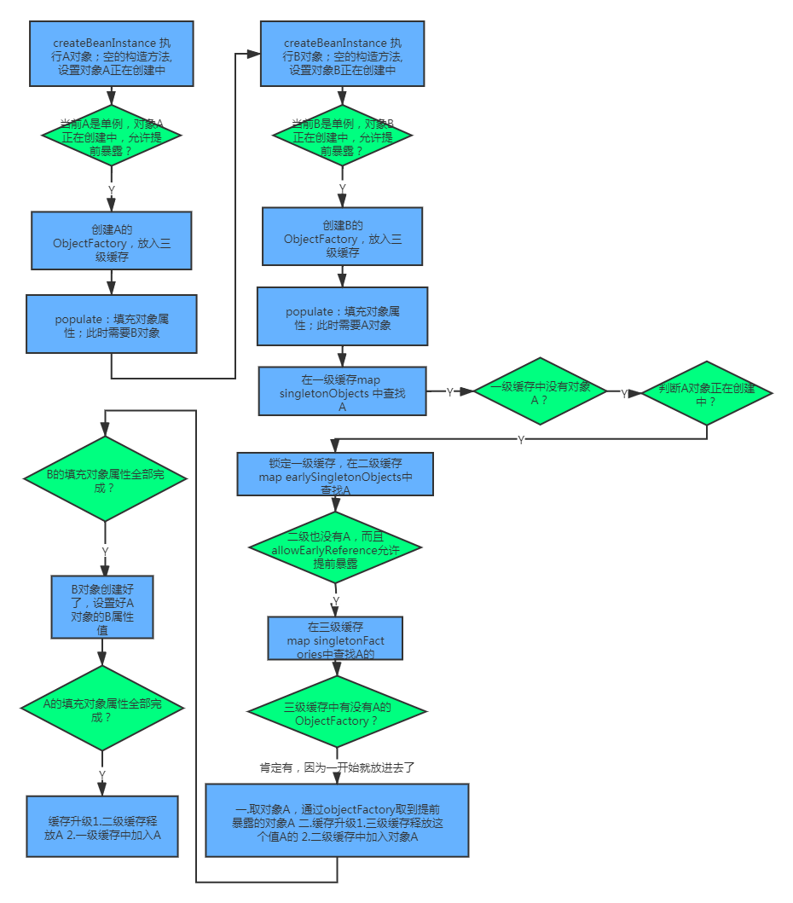

# 循环依赖

+ 什么是循环依赖

+ spring怎么解决循环依赖

+ 为什么要使用三级缓存解决循环依赖问题？一级缓存行不行？二级缓存行不行？


## 循环依赖出现的场景
两个bean都是通过构造器注入的方式，不能解决循环依赖问题

```java
@Component
public class A {

    private final B b;

    public A( B b) {
        this.b = b;
    }
}


@Component
public class B {

    private final A a;


    public B(A a) {
        this.a = a;
    }
}
```

```
┌─────┐
|  a defined in file [/Users/eli/code/JavaProject/hotloading/target/classes/com/eli/hotloading/entity/A.class]
↑     ↓
|  b defined in file [/Users/eli/code/JavaProject/hotloading/target/classes/com/eli/hotloading/entity/B.class]
└─────┘
```

+ 解决办法
    + 不使用构造器注入的方式，使用set方法注入
    + 在任意一个构造器中使用@Lazy通过延迟加载，在注入依赖时，先注入代理对象，当首次使用时再创建对象完成注入。
    + 注意一定要在构造器或者使用该类的对象标注@Lazy 负责仍然不会懒加载

```java
@Component
public class B {

    private A a;

    public B(@Lazy A a) {
        this.a = a;
    }
}
```
***只能解决singleton的注入，不能解决prototype的注入***


## 三级缓存

+ DefaultSingletonBeanRegistry.java
```java
// 一级缓存
/** Cache of singleton objects: bean name to bean instance. */
private final Map<String, Object> singletonObjects = new ConcurrentHashMap<>(256);

// 三级缓存
/** Cache of singleton factories: bean name to ObjectFactory. */
private final Map<String, ObjectFactory<?>> singletonFactories = new HashMap<>(16);

// 二级缓存     
/** Cache of early singleton objects: bean name to bean instance. */
private final Map<String, Object> earlySingletonObjects = new ConcurrentHashMap<>(16);
```

```java
@FunctionalInterface
public interface ObjectFactory<T> {

	/**
	 * Return an instance (possibly shared or independent)
	 * of the object managed by this factory.
	 * @return the resulting instance
	 * @throws BeansException in case of creation errors
	 */
	T getObject() throws BeansException;

}
```


***一级缓存为单例池、二级缓存为早期曝光对象、三级缓存为早期曝光对象工厂***


## 为什么不能使用二级缓存？
像示例的这种情况只用二级缓存是没有问题的。

但是假如有这种情况：a实例同时依赖于b实例和c实例，b实例又依赖于a实例，c实例也依赖于a实例。

a实例化时，先提前暴露objectFactorya到三级缓存，调用getBean(b)依赖注入b实例。b实例化之后，提前暴露objectFactoryb到三级缓存，调用getBean(a)依赖注入a实例，由于提前暴露了objectFactorya，此时可以从三级缓存中获取到a实例， b实例完成了依赖注入，升级为一级缓存。a实例化再getBean(c)依赖注入c实例，c实例化之后，提前暴露objectFactoryc到三级缓存，调用getBean(a)依赖注入a实例，由于提前暴露了objectFactorya，此时可以从三级缓存中获取到a实例。注意这里又要从三级缓存中获取a实例，我们知道三级缓存中的实例是通过调用singletonFactory.getObject()方法获取的，返回结果每次都可能不一样。如果不用二级缓存，这里会有问题，两次获取的a实例不一样。

