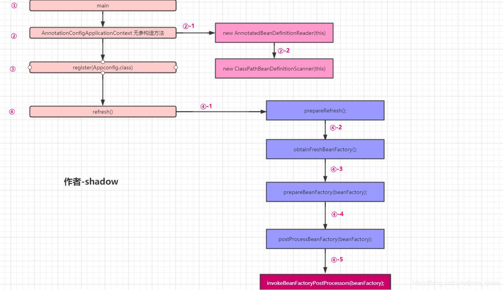

# 自动装配





## @SpringbootApplication
```java
@Target(ElementType.TYPE)
@Retention(RetentionPolicy.RUNTIME)
@Documented
@Inherited
@SpringBootConfiguration
@EnableAutoConfiguration
@ComponentScan(excludeFilters = { @Filter(type = FilterType.CUSTOM, classes = TypeExcludeFilter.class),
		@Filter(type = FilterType.CUSTOM, classes = AutoConfigurationExcludeFilter.class) })
public @interface SpringBootApplication {
```


## @EnableAutoConfiguration
@SpringbootApplication 复合注解，里面有@EnableAutoConfiguration，使用@Import读取metaInfo/spring.factories文件下的所有类
所以利用spi机制，实现自己的starter包只需要在自己包下定义factories文件，添加
```
# Auto Configure
org.springframework.boot.autoconfigure.EnableAutoConfiguration=\
  com.baomidou.mybatisplus.autoconfigure.MybatisPlusAutoConfiguration
```
即可进行自动装配
[https://www.cnblogs.com/warrior4236/p/13280755.html](https://www.cnblogs.com/warrior4236/p/13280755.html)

## 几种import方法
+ @Import(AutoConfigurationImportSelector.class) 直接导入一个类

+ 导入一个实现了ImportBeanDefinitionRegistry接口的类
z
+ 导入一个实现了ImportSelector接口的类 可以批量导入多个类

@import 在ConfigurationClassParser.java文件中会被调用，ConfigurationClassBeanFactoryPostProcessor

## @Condition的一些用法
[http://www.1024sky.cn/blog/article/616](http://www.1024sky.cn/blog/article/616)
[https://blog.csdn.net/yusimiao/article/details/99301346](https://blog.csdn.net/yusimiao/article/details/99301346)
