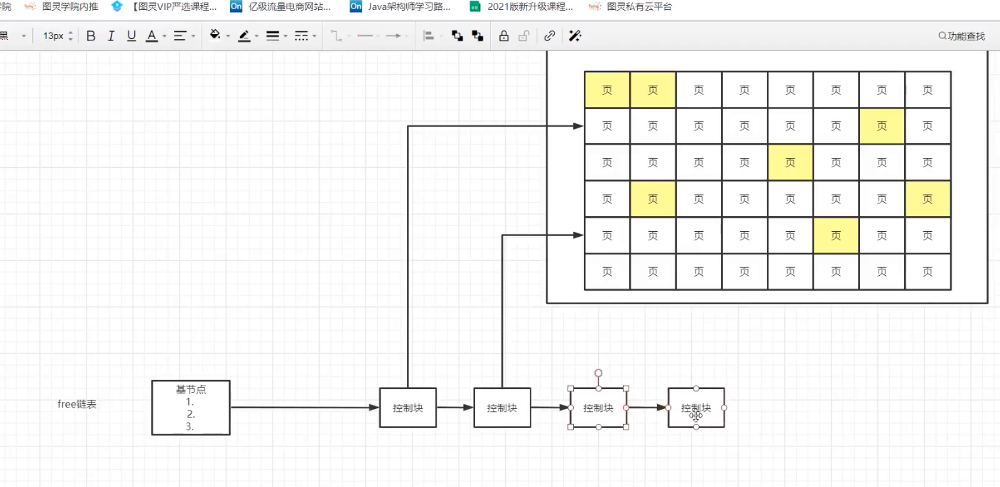
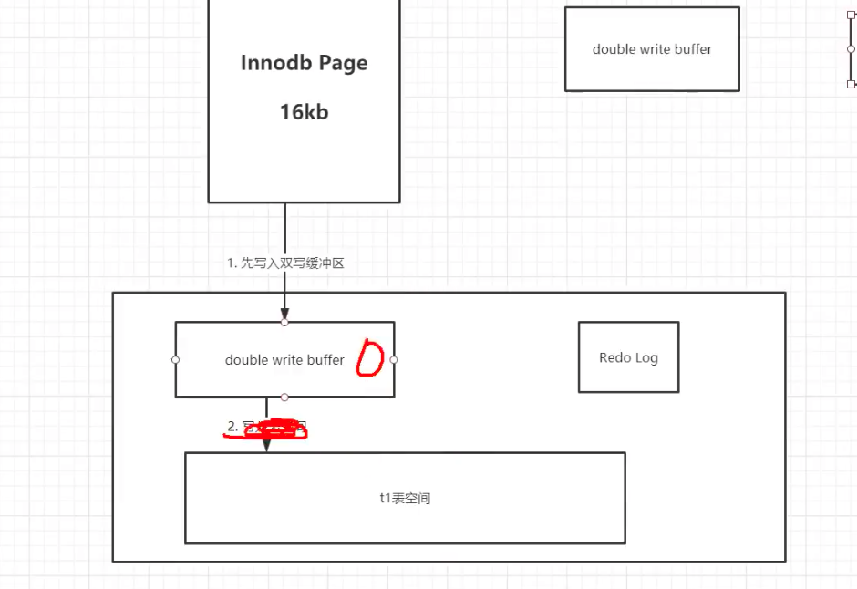

# BufferPool

[https://www.bilibili.com/video/BV1xh411Z79d?p=21&spm_id_from=pageDriver](https://www.bilibili.com/video/BV1xh411Z79d?p=21&spm_id_from=pageDriver)

[https://blog.csdn.net/wuhenyouyuyouyu/article/details/93377605](https://blog.csdn.net/wuhenyouyuyouyu/article/details/93377605)

innoDB buffer pool 默认128M

1. buffer 存储的是磁盘中页的副本，存在一个free链表存储的是buffer pool中的空白页

2. update bufferpool中的数据页，标记该页为脏页，后台线程会将脏页刷盘到磁盘中
3. flush链表中的节点指向的即buffer pool中的脏页

4. 当buffer pool满了，即free链表没有空闲的节点时候，需要使用淘汰机制，淘汰非热点数据，只时候需要使用到***LRU链表Least Recently Used***，采用最近最少最少的淘汰策略

5. 全表扫描可能会淘汰掉LRU的所有数据，LRU采用了分为热数据区域和冷数据区域两部分进行解决，每次淘汰掉冷数据区域的最后一个节点，同时插入冷数据区域的头节点，innoDB判断冷数据区域的节点两次间隔访问的时间是否大于1s，如果大于1s，则晋升到热数据区域，避免全表扫描不正常的访问，以此区分全表扫描

6. 何时进行刷盘，更新buffe_pool中的数据到磁盘中

update 操作的过程
+ 修改buffer pool里的数据页，该页被标记为脏页;
+ 生成一个redo log，存储这次的update 操作
+ redo log 持久化 (事务提交的时候)
+ binlog 生成持久化
+ 修改成功

如果直接不操作buffer pool 而是将磁盘中的页整页进行修改，是一个随机IO，因为磁盘中的数据是逻辑上连续的

7. binlog 和 redolog 的区别
+ binlog是mysql 的概念 redolog 是innoDB的概念
+ redolog 记录的是某一页开始的某一个记录被修改
+ binlog记录的就是sql 语句，相比而言redolog恢复数据更快
+ mysql 主从的时候只能使用binlog，因为redolog 记录的是某一页的数据，在多个mysql实例上不符合，而且redolog会更新

## 双写缓冲区
