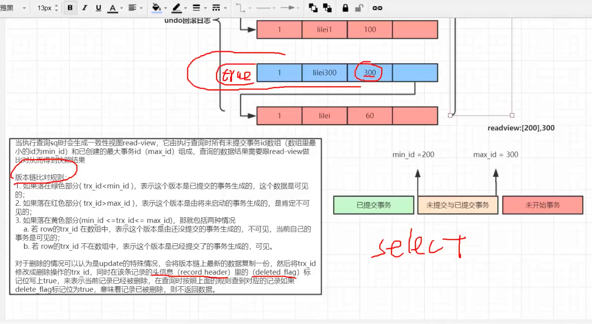

# MVCC

[https://www.bilibili.com/video/BV1YJ411J7vb/?spm_id_from=333.788.recommend_more_video.-1](https://www.bilibili.com/video/BV1YJ411J7vb/?spm_id_from=333.788.recommend_more_video.-1)

[https://blog.csdn.net/filling_l/article/details/112854716](https://blog.csdn.net/filling_l/article/details/112854716)

[https://dev.mysql.com/doc/refman/8.0/en/innodb-multi-versioning.html](https://dev.mysql.com/doc/refman/8.0/en/innodb-multi-versioning.html)

+ RR 和 RC 两种不同隔离级别在MVCC中的实现方式不同
    + RC 读已提交是每次select都会生成新的read-view
    + RR 可重复度在事务第一次select时会生成一个read-view 之后的select使用的都是第一个read-view