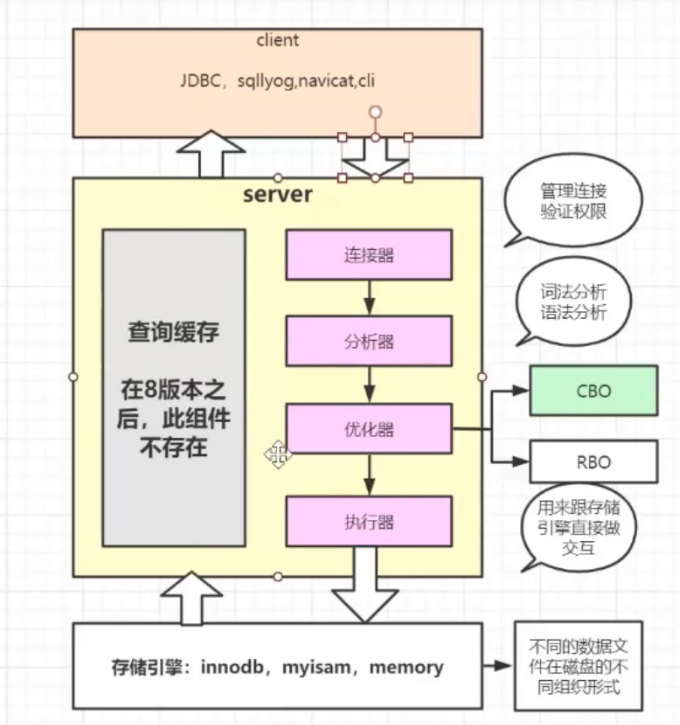
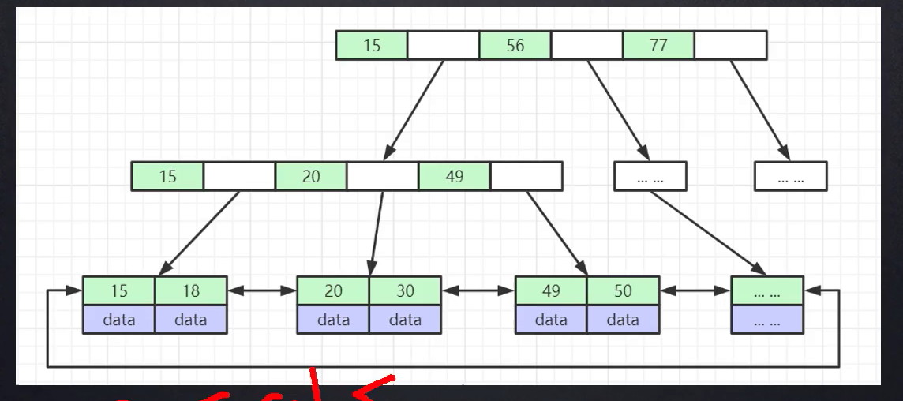

# 目录

+ Memory引擎使用的是hash，因为在内存中，快速

+ InnoDB索引实现(聚集)
    + 表数据文件本身就是按B+树组织的一个索引结构文件
    + 聚集索引-叶节点包含了完整的数据记录
    + 为什么建议InnoDB必须建主键，并且推荐使用整型的自增主键？
        + 自增的在插入b+树时总是在最后插入，而不自增的话会造成节点的分裂和平衡树，会有额外的性能消耗
    + innoDb的主键索引是聚集索引，而非聚集索引（二级索引）叶子节点存储的是主键值
    + 为什么非主键索引结构叶子节点存储的是主键值？（一致性和节省存储空间）
    + innoDB表有且仅有一个聚集索引
    + ***innoDB的节点对应一个Page，一般大小为16Kb，只在叶子节点存储数据是因为这样可以在非叶子节点存储更多的索引，从而降低树的深度，减少IO***

+ 什么是聚集索引
    + 聚集索引的叶子节点包含了完整的数据记录

+ 什么是非聚集索引
    + 索引文件和数据文件是分离的

+ Hash索引
    + 对索引的key进行一次hash计算就可以定位出数据存储的位置
    + 很多时候hash索引要比B+树索引更高效
    + ***仅能满足 “=”，“in”的查找，不支持范围查询*** 这点使用B+树可以有效解决，因为B+树的叶子节点之间用指针链接，提高区间访问的效率，可以很快的进行范围查找
    + hash冲突问题

+ 红黑树

+ B树和B+树的区别
+ 联合索引的底层存储结构

    + 比较的时候按照建联合索引的顺序逐个比较，如果相同，使用下一个字段进行比较

+ 索引最左前缀原则
    + 与联合索引的底层存储结构有关，类似与基数排序

+ OLAP
+ OLTP

+ 存储引擎 数据在磁盘中的组织方式

+ MyISAM和InnoDB使用的都是B+树，只不过InnoDB树的叶子节点存储的是整行的数据而MyISAM的叶子节点存储的是数据所在行的地址
+ innodb默认用主键作为索引建立B+树，没有指定的话会自动选取唯一的字段作为主键，如果不存在唯一字段会默认使用一个用户看不见的隐藏列rowID作为主键，之后再建立其他索引，叶子节点存储的不再是数据而是对应主键索引B+树的主键key

+ 回表
    + 如果创建索引的字段是其他字段，那么在叶子节点存储的是该记录的主键，然后再通过主键索引找到相应的记录，叫做回表
    + 回表可能出现的问题
        + 数据量比较少，建立索引后反而比没建索引慢了，这是因为触发了回表，IO时间变长了，但是数据量多的时候就不会比没建索引慢了

+ 索引覆盖 
    + 通过二级索引获取到了主键ID，在单独select ID的情况下不用再去主键索引查询了，这就叫索引覆盖
    + 可以通过建立联合索引的方式，在select字段中指定联合索引的字段，因为一次性就可以查处所有需要的字段了，就不需要回表了，这就做叫做索引覆盖

+ 索引下推（index condition pushdown, ICP）

+ 谓词下推

+ 最左匹配
    + 对于联合索引（name,age）select * from table where age=? and name =? 也会走索引，这是因为mysql底层的优化器进行了优化
    + 发现没有符合最左匹配但同样走了索引，可以检查是否全盘扫描索引，查询的字段全在联合索引内，触发了索引覆盖原则

+ MRR
+ FIC

## 索引分类
+ 主键索引
    + 一个表只能有一个主键
    + 不允许有空值

+ 唯一索引 unique
    + 索引列值必须唯一
    + 允许有空值
    + 如果是组合索引，则组合索引的组合必须唯一

+ 普通索引
    + 二级索引

+ 全文索引
    + 检索

+ 组合索引

## 一些面试中问的多的东西
+ 调优
+ 索引
+ MVCC
+ 存储引擎
+ 事物
+ 主从复制
+ 读写分离
+ 分库分表
+ 锁
+ 日志系统

## innoDB 和Myisam的区别
+ innodDB支持事务，myisam不支持
+ innodb支持外键，myisam不支持
+ innodDb支持表锁和行锁，myasim只支持表锁
+ innoDB是聚集索引，myisam是非聚集索引
+ Myisam 一般用于全文索引，但是innodb在mysql 8.0之后也有全文索引

