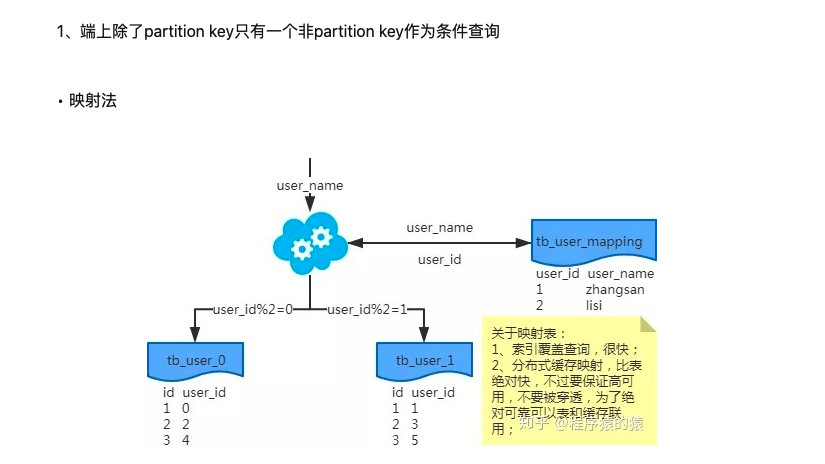

# 分库分表

这是支撑高并发的基础，面试必定会问，这都不知道，那只能回家了
## 面试
+ 为什么要分库分表？
    + mysql单表存储量推荐是百万级，超过这个量级sql查询缓慢，严重影响系统吞吐
+ 用过哪些分库分表中间件？
+ 不同分库分表中间件的优缺点？
+ 你们具体是如何对数据库进行垂直拆分或水平拆分的？
+ 现在有一个未分库分表的的系统，如何设计才可以让系统从未分库分表动态切换到分库分表上？
+ 如何设计动态扩容缩容的方案？
+ 分库分表后，id主键如何处理？

分表方式
+ range 
    + 扩容容易
    + 大部分请求都是最新的数据
    + 实际生产需要
+ hash
    + 可以平均分配请求压力
    + 扩容起来比较麻烦
    + 扩容的时候会有一个数据迁移的过程

分库分表方案更多的是对关系型数据库存储和访问机制的一种补充，而不是颠覆

分库分表就是为了解决由于数据量过大而导致数据库性能降低的问题，将原来独立的数据库拆分成若干数据库组成 ，将数据大表拆分成若干数据表组成，使得单一数据库、单一数据表的数据量变小，从而达到提升数据库性能的目的。

---
+ 分库方式
    + 垂直拆分
        + 专库专用，按照业务拆分
    + 水平拆分
        + 同一个库分为多个，根据某种规则进行分布

+ 分表方式
    + 垂直拆分
        + 类似于第二范式，按照字段进行拆分
        + 将访问频率高的字段组成一张表，剩下的访问低频的放在另外一张表，将原本的一张表进行垂直拆分
    + 水平拆分
        + 根据规则将一个表复制多份

+ 垂直拆分
    + 每个库（表）的结构都不一样
    + 每个库（表）至少有一列一样
    + 每个库（表）的并集就是全量数据
+ 优点：
    + 拆分后业务清晰
    + 数据维护简单，按不同业务放到不同机器上
+ 缺点：
    + 如果单表数据量大，写和读的压力依然很大
    + 部分业务无法关联join
---
+ 水平拆分
    + 每个库（表）的结构不一样
    + 每个库（表）的数据都不一样
    + 每个库（表）的并集就是全量数据
+ 优点：
    + 单库（表）的数据保持在一定的量，有助于性能提高
    + 提高了系统的稳定性和负载能力
    + 切分的表结构相同，程序改造少
+ 缺点：
    + ***数据的扩容有难度，维护量大***
    + 拆分规则很难抽象出来
    + 分片事务的一致性问题

## 分库分表带来的问题
+ 不同的数据库带来分布式事务问题
+ 维护成本
+ 跨库查询问题
+ 分布式全局唯一ID

## 中间件
+ proxy: 跨语言，不支持跨数据库
    + mycat
    + Atlas
    + mysql-proxy
+ jdbc: 不支持跨语言，支持跨数据库
    + sharding-sphere
    + TDDL

## sharding-sphere
+ sharding-jdbc 客户端分库分表
+ sharding-proxy 服务端分库分表

## 分库分表后如何部署上线
+ 双写 增量数据
+ 订阅binlog
[https://mp.weixin.qq.com/s?__biz=MzIwMDgzMjc3NA==&mid=2247483939&idx=1&sn=7abbf7865b705057ae56a1ba797f6d79&chksm=96f6604aa181e95c47f6d1534bf3695f567ddbc5f39749f9d4644266e4a7ce51fc4e779908fd&scene=21#wechat_redirect](https://mp.weixin.qq.com/s?__biz=MzIwMDgzMjc3NA==&mid=2247483939&idx=1&sn=7abbf7865b705057ae56a1ba797f6d79&chksm=96f6604aa181e95c47f6d1534bf3695f567ddbc5f39749f9d4644266e4a7ce51fc4e779908fd&scene=21#wechat_redirect)

+ 长时间停机分库分表
    + 挂公告维护
    + 后台临时程序，将原先的表数据分发到新表中
    + 修改原先的分片规则
+ 不停机双写方案
    + 既写老系统也写新系统
    + 后台迁移程序根据时间戳进行比对覆盖
    + 验证数据是否一样

---
## 分库分表如果使用一个不是分片的键怎么查询
+ 设立一个分片键和该键的映射表，利用索引覆盖查询到分片键

## 动态扩容缩容的分库分表方案
+ 停机扩容
    + 不推荐

+ 优化方案
    + 第一次分库分表，就一次性给他分个够，32个库，每个库32张表
    + 一台数据库服务器可以承载每秒2000的写并发