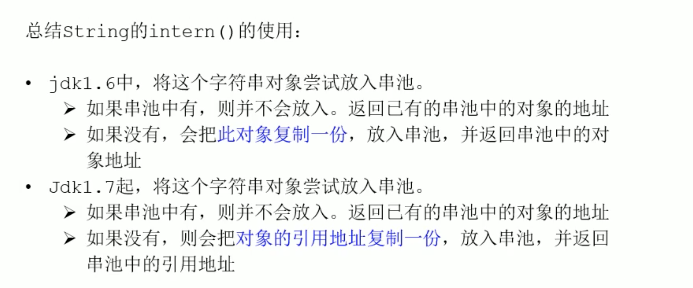

# 20210214

## StringTable

+ String 被声明为final，不可被继承
+ jdk8 底层使用的是char[] jdk9 使用的是byte[]
    + 存储结构发生变化，节约内存
    + char占两个字节
+ String代表不可变的字符序列，***不可变性***
+ String s = "" 通过字面量定义的方式定义的字符串存放在字符串常量池中
+ String s = "a" 与 String s = new String("a")的区别
    + 二者使用 == 判断地址是不同的
    + equals 应用类型比较默认比较的还是地址，但是String 重写了equals方法
+ 字符串常量池中是不会存储相同内容的字符串
    + 字符串常量池底层是一个固定大小的HashTable，HahsTbale底层是一个数组加链表的结构，即使用拉链法解决冲突
    + -XX:StringTableSize=
+ java形参只有值传递，引用类型传递的是对象的地址，也是值传递
+ String的内存分配
+ 8种基本数据类型
    + byte
    + char
    + int
    + double
    + long
    + float
    + boolean
    + short
+ jdk8 字符串常量池在堆内
+ String的基本操作
+ 字符串常量池在堆中，独立与新生代和老年代，是独立的一个空间？
+ 字符串的拼接操作
    + 常量与常量的拼接结果在常量池，***原理是编译器优化***
    + 常量池中不会存在相同内容的常量
    + 只要其中有一个是变量，结果就在堆中，变量拼接的原理是StringBuilder
        + ***注意final定义的常量区别与变量***

        ```java
         final String a ="a";
         final String b ="b";
         String c = a + b;
         String d = "ab";
        ```
        此时c 和 d仍然是同一个地址，指向字符串常量池中ab的地址
    + 如果调用intern方法，则主动将常量池中还没有的字符串对象放入池中，并返回此对象地址
+ 字符串拼接底层原理
    + 使用  + 号进行字符串拼接，查看字节码反汇编的结果可以看出使用的是StringBuilder
+ 字符串拼接不一定使用的是StringBuilder，如果拼接符号左右两边否是字符串常量或常量引用，则仍然使用编译期优化，非StringBuilder的方式
+ 拼接操作与append的效率对比
    + 拼接 + 每次都会创建一个StringBuilder对象，最后还会使用toString()方法new 一个String对象，因此效率低下,进行GC需要花费额外的时间
    + 使用append方式，自始至终只使用了一个StringBuilder对象 
    + 循环体内字符串的连接，推荐使用StringBuilder
    + 使用StringBuilder的优化方式： 如果确定了字符串长度的最高值，可以指定StringBuilder内的char数组长度

    ```java
        new StringBuilder(int capacity)
    ```
+ ***intern***
+ new String("ab") 会创建几个对象
    + 看字节码可以发现除了new String对象之外，还有ldc “ab”，调用init方法，所以还会使用到字符串常量池里的字面量
+ new String("a") + new String("b")会创建几个对象
    + StringBuilder
    + new String()
    + 常量池里的a
    + new String()
    + 常量池里的b
    + toString() 方法里new的String
        + toString方法的调用在字符串常量池中没有生成新的对象

    + jdk7及其之后的版本new 一个String对象调用intern方法会在常量池中创建一个空间指向new 出来的String对象，用以节省空间
    + jdk6 调用intern方法，会在堆空间和永久代都创造对象
+ 调用intern方法，如果字符串常量池已经存在，直接返回，不做处理



+ intern的空间效率测试
    + 对于程序中大量存在的字符串，***尤其存在很多重复字符串时***，使用intern() 可以节省内存空间

+ StringTable的垃圾回收