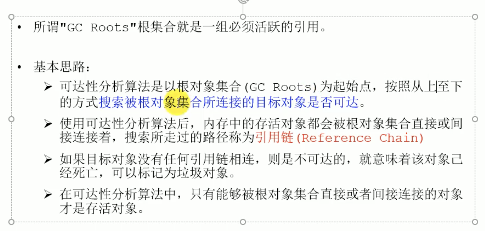

# 20210215

## 垃圾回收
+ 什么是GC，为什么需要GC
    + 不进行垃圾回收，内存迟早会消耗完
    + JVM将整理出的碎片分配给新的对象
    + 业务越来越庞大，没有GC就不能保证应用程序的正常运行
+ 什么是垃圾
    + 垃圾是指***运行程序中没有任何指针指向的对象***，这个对象就是需要被回收的垃圾
+ 内存溢出与内存泄漏
+ Java的垃圾回收机制
    + 自动内存管理，开发人员无需自己手动分配释放内存；
    + 开发人员更专注与业务开发；
+ 频繁收集新生代，较少收集老年代，基本不动方法区
+ 垃圾回收算法概述
+ 垃圾回收
    + 标记阶段
        + 引用计数算法
        + 可达性分析算法
    + 清除阶段
        + 标记清除算法
        + 复制算法
        + 标记压缩算法

+ 死亡对象：一个对象不再被任何存活对象引用，既可以宣判已经死亡
+ 引用计数算法（Reference Counting）***Java没有采用这个算法*** 每个对象都保存一个整形的引用计数器，用以记录对象被引用的情况；
    + 对于一个对象A，只要有一个对象引用了A，A的引用计数器加一；引用失效时，引用计数器就减一；引用计数器为0时，即可被回收
    + 优点
        + 实现简单，垃圾对象便于辨识；判定效率高，回收没有延迟
    + 缺点
        + 需要单独的字段存储引用计数，增加了存储开销
        + 每次赋值都需要更新计数器，增加了时间开销
        + ***无法处理循环引用的情况***，这个缺陷导致java没有使用引用计数算法

+ 可达性分析算法（根搜索算法、追踪性垃圾收集、Tracing Garbage Collection）
    + 可以解决循环引用问题，避免内存泄漏

+ GC roots包含以下几种类型：
    + 虚拟机栈中的引用，局部变量表里的引用类型
    + 本地方法栈中的对象
    + 方法区中的静态属性引用的对象（jdk7静态变量在堆空间）
    + 字符串常量池里的引用
    + 被同步锁synchronized持有的对象
    + Java虚拟机内部的引用：系统类加载器，class对象
+ 可达性分析必须保证一致性，所以才有STW现象的发生
    + CMS 在枚举ROOT的时候也会出现停顿
+ 对象的finalization机制
    + 垃圾回收对象之前，总会先调用finalize方法（已经复活的对象不会再调用finalize方法）
    + 永远不要主动调用对象的finalize方法，原因如下：
        + 调用finalize可能会导致对象的复活
        + 一个糟糕的finalize会严重影响GC性能
    + 虚拟机中的对象的三种状态：
        + 可触及的状态： 从根节点，可以访问到该对象
        + 可复活的状态： 对象的所有引用都被释放，但是对象有可能在finalize()中复活，放入finailze线程进行执行
        + 不可触及的状态：对象finalize被调用，并且没有复活，***不可触及的对象不可能复活，因为finalize只会被调用一次***
    + 只有对象在不可触及的状态时，才能被回收

+ finalize 复活对象后，再不会调用finalize方法，如果没有与GC root 关联则直接进入不可触及状态
+ finalize 可复活示例
+ finalize()方法中一般进行资源的释放与清理工作，如关闭文件、套接字连接池操作等

+ GC ROOTS 工具溯源
    + MAT java堆内存分析器
    + Jprofiler
+ -XX:+HeapDumpOnOutOfMemoryError 发生OOM后生成heap dump文件