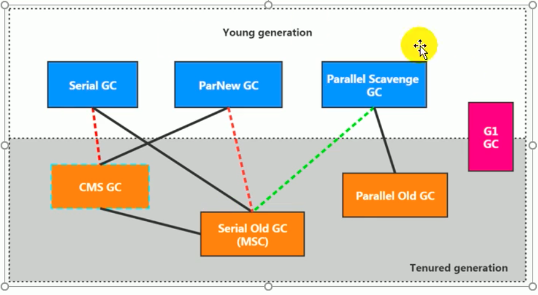
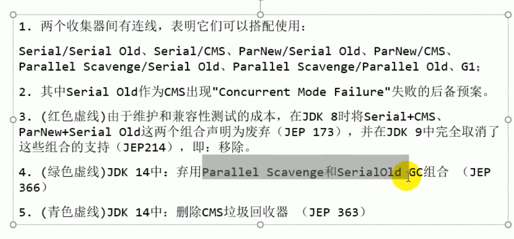

# 20210217

## 垃圾回收

+ 垃圾回收的并行与并发
    + 并行：指多条垃圾回收线程并行工作，但此时用户线程仍处于等待状态，如parallel old，new 
    + 并发：指用户线程与垃圾回收线程同时执行（但不一定是并行的，可能会交替执行），垃圾回收线程时不会停顿用户程序的运行

+ 安全点与安全区域
    + 安全点： 程序运行时并非所有地方都能停顿下来进行GC，只有在特定位置才能停顿下来进行GC，这些位置被称为***安全点***
        + 选择一些执行时间较长的指令作为safe point，例如：方法调用、循环跳转和异常跳转等；
        + 主动式中断： 设置一个中断标志，各个用户线程运行到安全点的时候，轮询这个标志，如果中断标志为真，就将自己挂起
    + 安全区域：指在一段代码片段中，对象的引用关系不会发生变化，在这个区域中的任何位置开始GC都是安全的
     + 安全区域是为了解决某些用户线程处于阻塞或睡眠状态，无法达到安全点进行垃圾回收所创建的方法

## 引用

引： 这样的一个场景，需要这样的对象，如果内存空间够，则保留这些对象；当内存空间在完成垃圾回收后的空间还是比较紧，希望可以抛弃这些对象（适合用于缓存）
+ ***面试题： 强引用、软引用、弱引用、虚引用有什么区别？具体使用场景是什么？***
+ 强、软、弱、虚，四种引用类型强度依次递减
+ 内存溢出只与强引用有关系，与其他引用没有关系，因为软、弱、虚都会被回收
+ 强引用
    + 无论任何情况下，只要强引用关系还存在，垃圾收集器就永远不会回收掉被引用的对象
    + 强引用是造成Java内存泄漏的主要原因
+ 软引用
    + 在系统将要发生内存溢出之前，把软引用的对象进行回收，如果还不够才会报OOM
    + 内存不足即回收
    + 软引用通产被用来实现内存敏感的缓存
    + ***mybatis 内部类中使用了软引用***
    + 有引用队列，回收后放入引用队列
+ 弱引用
    + 当垃圾收集器工作时，无论空间是否足够，都会回收掉弱引用关联的对象
    + 发现即回收
    + 有引用队列，回收后放入引用队列
    + ***面试题：你在开发过程中有使用过WeakHashMap吗***
    + [WeakHashMap使用场景](https://blog.csdn.net/u013467442/article/details/105826778)
    + ThreadLocalMap中的Entry使用的就是弱引用[https://www.zhihu.com/question/37401125](https://www.zhihu.com/question/37401125)
+ 虚引用    
    + 无法通过虚引用获取一个实例对象
    + 使用虚引用的唯一目的就是能在这个对象被回收时收到一个系统通知
    + ***对象回收跟踪***
    + 在被回收之前放入引用队列中;
    + 试图通过虚引用的get方法获得对象，总是null;
    + 可以用来记录一些资源释放操作的执行时间和记录;
    + 必须使用引用队列;
    + clear()方法，即将对象置为null;
+ 终结器引用 FinalRefernece
---

## 关于ThreadLocal
[https://blog.csdn.net/jh39456194/article/details/107304997](https://blog.csdn.net/jh39456194/article/details/107304997) ThreadLocal的原理实际上是使用了Thread类里的ThreadLocalMap存储key 和value，其内部是一个EntryTable
```java
  static class Entry extends WeakReference<ThreadLocal<?>> {
            /** The value associated with this ThreadLocal. */
            Object value;

            Entry(ThreadLocal<?> k, Object v) {
                super(k);
                value = v;
            }
        }

        /**
         * The table, resized as necessary.
         * table.length MUST always be a power of two.
         */
        private Entry[] table;
```
并且这个entry继承了虚引用，当使用的ThreadLocal强应用断开后，线程Thread没有销毁，ThreadLocalMap-》Entry保持着引用链，但因为entry继承了WeakReference，在强引用断开后，GC发生时，这个ThreadLocal会被回收，但是value还是保持着和Thread-》ThreadLocalMap的引用链，此时这个value将不会被用到，因为key已经被销毁。那么ThreadLocal是如何避免内存泄漏的呢？通过查看源码得知，ThreadLocal在get的时候，判断entry的key即ThreadLocal对象是否为null，如果为null，则会调用expungeStaleEntry方法将value至为null，断掉引用链，帮助GC
```java
private int expungeStaleEntry(int staleSlot) {
            Entry[] tab = table;
            int len = tab.length;

            // expunge entry at staleSlot
            tab[staleSlot].value = null;
            tab[staleSlot] = null;
            size--;

            // Rehash until we encounter null
            Entry e;
            int i;
            for (i = nextIndex(staleSlot, len);
                 (e = tab[i]) != null;
                 i = nextIndex(i, len)) {
                ThreadLocal<?> k = e.get();
                if (k == null) {
                    e.value = null;
                    tab[i] = null;
                    size--;
                } else {
                    int h = k.threadLocalHashCode & (len - 1);
                    if (h != i) {
                        tab[i] = null;

                        // Unlike Knuth 6.4 Algorithm R, we must scan until
                        // null because multiple entries could have been stale.
                        while (tab[h] != null)
                            h = nextIndex(h, len);
                        tab[h] = e;
                    }
                }
            }
            return i;
        }
```
+ 如果之后没有调用get方法，则这个value对象仍然不会被回收，且不会在程序用到，造成内存泄漏，因此至少需要调用一次ThreadLocal的remove方法，主动销毁这个entry
```java
 private void remove(ThreadLocal<?> key) {
            Entry[] tab = table;
            int len = tab.length;
            int i = key.threadLocalHashCode & (len-1);
            for (Entry e = tab[i];
                 e != null;
                 e = tab[i = nextIndex(i, len)]) {
                if (e.get() == key) {
                    e.clear();
                    expungeStaleEntry(i);
                    return;
                }
            }
        }
```

---
## 垃圾回收器

+ 垃圾回收器分类
    + 按线程数分 （都有STW）
        + 串行垃圾回收器
            + 单CPU
            + client默认使用串行垃圾回收器
        + 并行垃圾回收器
    + 按照工作模式分
        + 并发式垃圾回收器
            + 用户线程与垃圾回收线程交替执行，尽可能减少STW时间
        + 独占式垃圾回收器
    + 按碎片处理方式分类
        + 压缩式垃圾回收器
        + 非压缩式垃圾回收器
    + 按工作的内存区间分
        + 年轻代垃圾回收器
        + 老年代垃圾回收器


+ GC性能指标
    + ***吞吐量***： 运行用户代码时间占总运行时间的比例
    + 垃圾收集开销： 垃圾收集时间占总时间的比例
    + ***暂停时间***： 执行垃圾回收时，工作线程被暂停的时间 STW的时间
    + 收集频率： 发生的频率
    + 内存占用： Java堆区所占的内存大小
    + 快速： 一个对象诞生到被回收的时间

+ 在最大吞吐量优先的情况下，降低暂停时间

+ 垃圾回收器搭配



+ 根据具体的应用场景选择最合适的垃圾回收器搭配

+ 如何查看使用的垃圾回收器
    + -XX:+PrintCommandLineFlags

+ serial收集器
    + 年轻代使用的复制算法
    + 串行
    + STW机制
    + 针对老年代提供了serial old，使用的是标记-压缩方式，同样是串行回收
        + 可以作为CMS的后备方案
    + -XX: +UseSerialGC

+ ParNew回收器
    + 并行回收
    + 年轻代使用的复制算法
    + 与serial不同的就是多条垃圾回收线程
    + -XX: +UseParallellGC
    + -XX：ParalleGCThreads，限制线程数量,默认和CPU线程数目相同


+ Parallel Scavenge
    + ***吞吐量优先***
    + 具有自适应调节策略
    + UseAdaptivePolicy，自适应调节策略，会对年轻代大小，eden 幸存者区比例，晋升老年代年龄进行动态调整，以达到堆、吞吐量、和停顿时间之间达到一个动态平衡