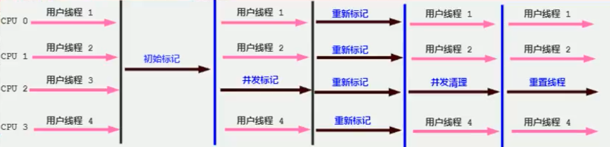
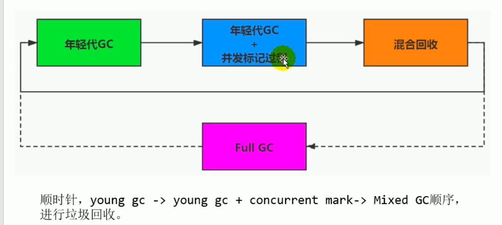

# 20210218

## CMS垃圾回收器

+ CMS（Concurrent-Mark-Sweep）垃圾回收器
    + 并发收集器
    + 使用标记清除算法
    + 也有STW
+ CMS阶段

    + 初始标记
        + ***这个阶段会有STW，标记出GC roots能直接关联到的对象，时间非常短暂***
    + 并发标记
        + 从GC Roots的直接关联对象开始遍历整个对象图的过程，这个过程比较耗时，但是不需要停顿用户线程，可以与垃圾回收线程一起并发执行
    + 重新标记
        + 修正并发标记期间因为用户程序运作而导致标记产生变动的那一部分对象的标记记录
        + ***存在STW，比初始标记阶段暂停时间短***
    + 并发清除
        + 清理掉已经死亡的对象
        + ***由于不需要移动存活对象，所以可用户线程并发执行***
+ CMS的最耗时阶段是并发标记与并发清理阶段，但是可以和用户线程并发执行，所以STW时间较短
+ 在堆内存的使用率达到一定阈值时，就进行CMS垃圾回收，以保证CMS回收期间用户线程有足够的内存空间支持程序运行
+ 如果收集期间，预留的内存空间不足，则会出现 Concurrent Mode Failure，这时候后会使用后背方案，使用Serial Old收集器进行老年代的垃圾回收
+ 使用标记清除算法，会产生内存碎片，只能选择空闲列表的方式执行内存分配
+ 为什么不实用标记压缩算法？
    + 因为并行清除期间使用压缩算法会导致对象地址发生改变，而此时程序还在运行之中，会造成不必要的问题
    + 不然只能在清除阶段暂停用户线程

+ CMS弊端
    + 会产生内存碎片，分配大对象时，会导致触发Full GC
    + 对CPU资源敏感，会使应用程序变慢，吞吐量降低
    + 无法处理浮动垃圾（并发标记阶段产生的新垃圾）

## G1回收器（Garbage First）
    区域化分代式
    期望在延迟可控的情况下，尽可能提高吞吐量
+ 优先回收价值最大的Region
+ JDK 9以后是默认的回收器， JDK8默认是Parallel收集器

+ G1回收器的特点
    + 并行与并发
        + 并行性 可以有多个回收线程同时执行
        + 并发性 与用户线程交替执行
    + 分代收集
        + 将堆空间分为若干个区域，包含逻辑上的年轻代和老年代
    + 空间整合
        + Region之间是复制算法，整体上可以看成是标记压缩方法，可以避免内存碎片化
    + 可预测的停顿时间模型
        + 每次根据允许的收集时间，优先回收价值最高的Region
+ 缺点
    + 内存占用与运行时的额外负载比CMS要高
    + CMS在小内存的表现大概率要优于G1，G1在大内存应用上发挥优势
+ 参数
    + -XX:MaxGCPauseMillis 期望达到的最大GC停顿时间
+ 使用场景
    + 面向服务端应用，大内存，多处理器
    + 需要低延迟，同时堆内存比较大
+ region的使用介绍
    + Humognus区域主要用来存储大对象
    + 如果一个H区存储不下大对象，G1会寻址连续的H区存储这个大对象

+ G1回收器的主要回收过程
    + 年轻代GC
    + 老年代并发标记过程
    + 混合回收
    + 强力回收：单线程、独占式、高强度FullGC

+ GC日志分析工具
    + GCViewer
    + gceasy