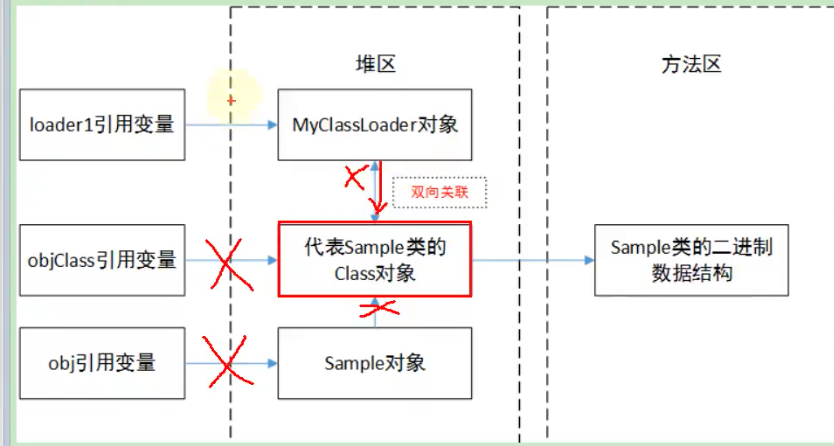

# 20210222

## 类的加载过程

+ 类的生命周期概述

+ 加载
    + 将Java类的字节码文件加载到内存中，并在内存中构建出Java类的原型--类模板对象
    + class 加载过程中，在元空间生成class信息，并在堆中创建一个class实例，该实例指向方法区中的类信息
+ 链接
    + 验证
        + 版本
        + 魔术
        + 是否继承final
        + 是否实现抽象方法
        + 符号引用的验证，检查常量池里的类或者方法是否存，如果类不存在，抛出NoClassDefFoundError，如果方法没找到，则会抛出NoSuchMethodError
    + 准备
        + 为类的静态变量分配内存，并默认初始化
        + 静态常量在编译的时候已经分配，并记录在常量池内，准备阶段会显示赋值
    + 解析
        + 将类、接口、方法、字段等的符号引用转换为直接引用

+ 初始化
    + 为类的静态变量显示赋值
    + 到了初始化阶段，才开始真正执行类中定义的java程序代码
    + <clint>方法 静态变量赋值，静态代码块在clint中合并执行
    + 在加载一个类之前，jvm总是会试图加载这个类的父类，因此父类的clint在子类的clint之前被调用，父类的static块优先级高于子类
    + 由父及子，静态现行
    + 静态常量static final在准备阶段已经准备阶段已经赋值，所以不会有clint方法，
    除非是应用类型使用的是new 的方式，才会在初始化阶段clint中赋值

    + clint 方法的线程安全性
    + 类的主动使用与被动使用
        + 主动使用时clint方法会被调用，被动调用时clint方法不会被调用
    + 主动使用举例
        + 当创建一个类的实例时，new 反射 clone 反序列化
        + 调用类的静态方法，即调用invokestatic
        + 当使用getstatic putstatic时
        + Class.forName()
        + 初始化父类
            + 初始化一个类的时候，不会初始化它实现的接口
        + 接口中的default方法，直接或间接实现这个接口的类的初始化要先初始化这个接口
        + main方法
    + 类的被动使用举例 即会加载但是不会执行类的初始化操作，即不会调用clint方法
        + 通过子类调用父类的静态字段时，不会导致子类初始化
        + 通过数组定义类引用，不会导致此类的初始化
        + 引用常量不会导致该类的初始化，在准备阶段已经完成赋值
        + 调用classLoader的loadclass 不会初始化类

+ 使用
+ 卸载
    + 一个类何时结束生命周期，取决于代表它的Class对象何时结束生命周期
    
        + 该类的所有实例都已经被回收（包括子类实例）
        + 类加载器被回收
        + Class对象没有被任何地方引用，无法在任何地方通过反射访问该类的方法
    + 满足上述三个条件后，类允许被卸载，在方法区进行垃圾回收的时候可以回收

## 类加载器
+ 类的显示加载
+ 类的隐式加载
+ 比较两个类是否相同，同一个类加载器加载的，类名相同

+ 类的加载器分类
+ 基本数据类型不需要类加载器，获取类加载器返回的为null
+ 数组类型获取类加载器返回的是数组元素对象的类加载器
+ loadClass
+ findClass
+ defineClass
+ 双亲委派机制的优势与劣势
    + 优势
        + 避免类的重复加载
        + 防止核心API不被篡改

+ 热替换的代码实现
+ 沙箱安全机制

## Java9 新特性
+ 双亲委派机制发生了变动